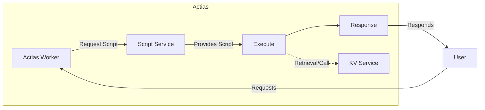

<p align="center">
	<br>
	
	
</p>

# Actias
Actias is a lua based serverless scripting platform for HTTP workers and jobs.

```lua
add_event_listener("fetch", function(request)
    return {
        body = json.stringify({hello = "world"}),
        headers = {["Content-Type"] = "application/json"}
    }
end)
```

## What actually is Actias?

> A pretty diagram of how Actias works from a general overview.

Actias, bearing resemblance to Cloudflare Workers, operates as a fully distributed system that includes Key-Value (K/V) storage combined with a bunch of other services. In this sense, it decentralizes the management of services which boosts scalability and efficiency. 

Upon uploading your lua file, the script is independently managed and run by the Actias worker, evolving into a server-side computational resource. This bears the substantial advantage of maintaining a web operation that is consistently multi-threaded, thus enhancing performance and availability due to high-level parallelism. Essentially operating as a layer that handles request-response cycle in between your users’ HTTP interactions and your server. 

Your code enables a script instance per request, with every one of them being short-lived. These scripts run server-side, guaranteeing real-time responses to the user's queries and interactions. This design ensures that Actias is exceptionally robust and flexible, neither buckling under high demand nor wasting resources during quieter periods.

In the background, Actias consists of a myriad of distributed services that share a conversation, allowing the entire program to run smoothly and cohesively. It's a network of interconnected and interdependent components that make up your backend. Despite this complexity, Actias is extraordinarily user-friendly – hand it your script, and we'll take care of the execution and management.

## Deployment
### Docker Compose
`docker-compose` is an expirementing/local node option. It is not meant for production deployments but it will be relatively stable for deployments. This is the only option for now as this is still heavily in development. This is an AIO solution and deployment is as easy as `docker-compose up -d`, however you should run scylla and postgres seperately for anything important.
### Kubernetes
**TODO**

## Todos
Things that should be added but are incomplete or not added.
- [ ] Live Development
  - Websocket based way to develop Actias through the CLI without constantly publishing or polluting revisions.
- [ ] Vault
  - Service for storing secrets, should also be subject to ACL controls
- [ ] Split `worker` into `worker_core` and `worker_service`
  - Worker should be split in a way that it can be embedded in the CLI and used to locally develop.
    - KV and other services that depend on actias will be stored locally in a JSON (`dev.json`)