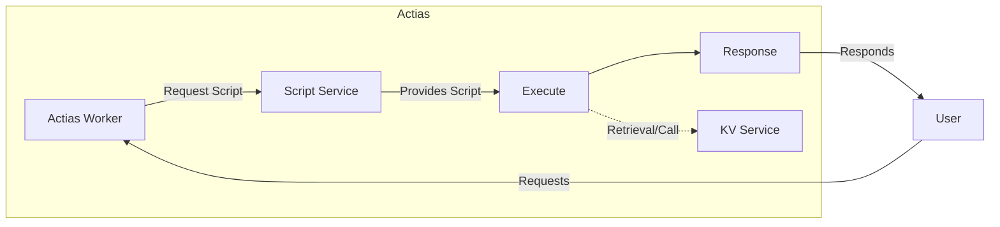

<p align="center">
	<br>
	
	
</p>

# Actias
Actias is an open-source, serverless platform designed for running stateless functions written in Lua. It provides everything you need to build and deploy applications without worrying about scaling, databases, or state management. With Actias, you simply upload your Lua script, and the platform takes care of running it reliably and efficiently across the globe. Built-in services like Key/Value storage and database access make it easy to manage data and persist state, so you can focus on your code instead of infrastructure. Actias is designed to be accessible for everyone, whether you're learning to code or building professional applications. Actias offers a simple, powerful suite of tools to bring your ideas to life without the complexity of server management.

```lua
add_event_listener("fetch", function(request)
    return {
        body = json.stringify({hello = "actias"}),
        headers = {["Content-Type"] = "application/json"}
    }
end)
```

## Who is it for?
Actias was designed with multiple goals in mind, but at its core, it exists to make coding and deploying applications easier for everyone. One of the biggest roadblocks for beginners is infrastructure, getting started often means dependency management, installing databases, choosing frameworks, handling threading issues, and more. Even after building an app, newcomers often try to share it by sending "localhost:80" to friends, only to realize that making an app accessible to others involves purchasing a VPS, learning Linux, deploying and hosting, managing updates, buying a domain, and setting up SSL certificates. While these are valuable skills that developers should eventually learn, the reality is that platforms like AWS and GCP exist precisely because people want to avoid these complexities. Yet those platforms have their own set of issues.

Actias is for students, educators, and programmers who want to deploy server-side code without getting overwhelmed by the details of infrastructure. The idea for Actias came from my own experiences and over years of iteration and especially during my time at Indiana University, I saw firsthand how the barrier to entry stops people from applying their coding skills. Actias is primarily developed as an educational tool, but it’s also adaptable for real businesses. It’s meant for both beginners and professionals, and for enthusiastic programmers who want to contribute new features. That’s why Actias is open source, to empower anyone to use, learn from, and improve the platform.

While Actias is still in heavy development, it aims to provide documentation and a built-in blog. These resources are designed to teach you how Actias works and how you can use it and how it differs from traditional development approaches (while teaching the traditional approaches too). The blog and documentation will cover a range of general concepts relevant to web and service development. Actias is a development environment, and a learning platform for anyone interested in modern application development.

## What actually is Actias?

> A pretty diagram of how Actias works from a general overview.

Actias, bearing resemblance to Cloudflare Workers, operates as a fully distributed system that includes Key-Value (K/V) storage combined with a bunch of other services. In this sense, it decentralizes the management of services which boosts scalability and efficiency. 

Upon uploading your lua file, the script is independently managed and run by the Actias worker on an as-needed basis. This has the advantage of maintaining operations that are consistently multi-threaded, each script execution runs in it's own context which enhances performance and availability due to high-level parallelism. Essentially operating as a layer that handles request-response cycle in between your users’ HTTP interactions and your server. 

Your code has a script instance per request, with every runtime having an almost instant startup and execution cost while being short-lived. These scripts run server-side, guaranteeing real-time responses to the user's queries and interactions. This design ensures that Actias is exceptionally robust and flexible, it will not buckle under high demand nor waste resources during quieter periods.

In the background, Actias consists of many distributed services which allow the entire program to run smoothly. It's a network of interconnected and interdependent components that make up your backend that you never have to deal with outside of the high level APIs. Despite this complexity, Actias is extraordinarily user-friendly, hand it your script, and it will take care of the rest.

## Deployment
### Docker Compose
`docker-compose` is an expirementing/local node option. It is not meant for production deployments but it will be relatively stable for deployments. This is the only option for now as this is still heavily in development. This is an AIO solution and deployment is as easy as `docker-compose up -d`.
### Kubernetes
**TODO**

## Todos
Things that should be added but are incomplete or not added.
- [ ] Live Development (in-progress)
  - Websocket based way to develop Actias through the CLI without constantly publishing or polluting revisions.
- [ ] Replace postgres in `script-service` and `actias-api` with MySQL
  - Allows us to use TiDB or Vitess for distributed SQL
- [ ] Actias SQL service
  - Use [mvsqlite](https://github.com/losfair/mvsqlite) or [litefs](https://github.com/superfly/litefs/blob/main/docs/ARCHITECTURE.md)
  - The idea is to offer SQL by manipulating the layer which Sqlite uses to read/write to be distributed.
- [ ] Metric Service
  - Store metrics and logs of all requests/resources used per request
  - This should have some regexes and ML algorithm for determining sensitive data in the request body and redacting it
- [ ] Vault
  - Service for storing secrets, should also be subject to ACL controls
- [ ] Split `worker` into `worker_core` and `worker_service` (backlog)
  - Worker should be split in a way that it can be embedded in the CLI and used to locally develop.
    - KV and other services that depend on actias will be stored locally in a JSON (`dev.json`)
- [ ] WASM runtime with WIT interface (backlog)
  - Will need its own binded host functions for interfacing with network since WASI doesn't have a network implementation.
- [ ] Repository (backlog)
  - Lua repository for Actias specific dependencies, interacted with through the CLI
  - Should have ability to control package versions, have descriptions, publishers, etc
  - Dependencies and versions should be stored in the `project.json`
  - Router module should be moved from templates and added to the repo
  - Additional packages that could exist: `postgrest`
