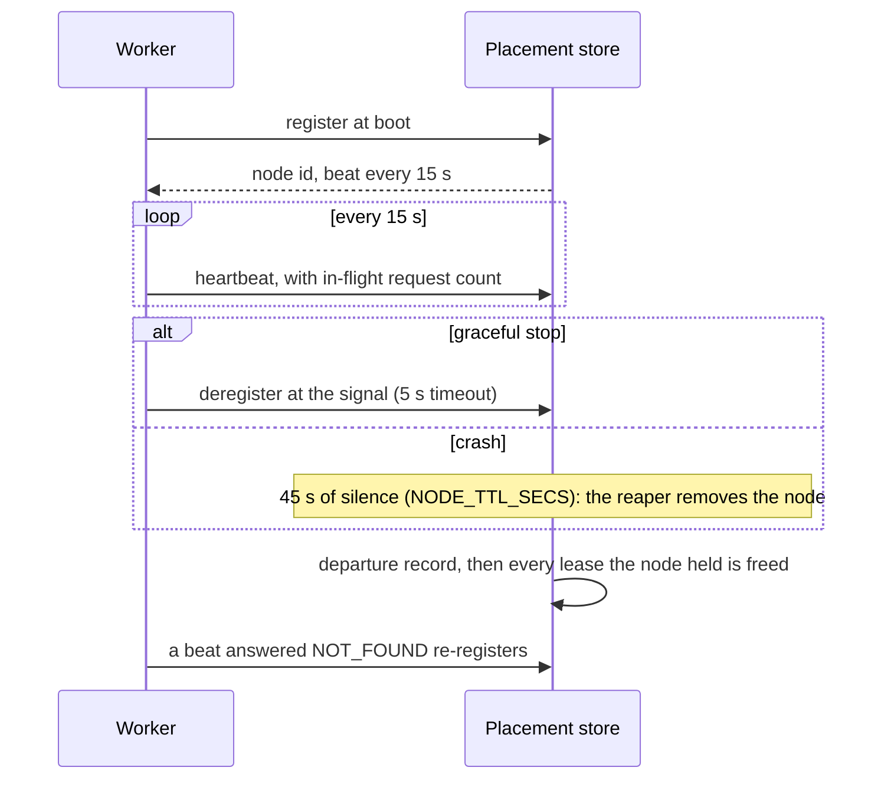

None of this is needed to build on Actias. It explains how the platform
behaves under load, for readers who want the mechanics behind the
promises in [guarantees](/docs/runtime/guarantees).

## Services

<table>
  <thead>
    <tr>
      <th>Service</th>
      <th>Stores</th>
      <th>Role</th>
    </tr>
  </thead>
  <tbody>
    <tr>
      <td>worker</td>
      <td>SQLite per object, local caches</td>
      <td>
        runs scripts, hosts objects, serves HTTP and the node-to-node data plane
      </td>
    </tr>
    <tr>
      <td>script service</td>
      <td>Postgres, Redis, blob storage</td>
      <td>scripts and revisions, project policy, live dev sessions</td>
    </tr>
    <tr>
      <td>placement service</td>
      <td>Postgres</td>
      <td>
        the placement store: object leases, node membership, alarms, the
        instance directory; one per region
      </td>
    </tr>
    <tr>
      <td>kv service</td>
      <td>Postgres by default; ScyllaDB selectable</td>
      <td>typed key-value pairs by project and namespace</td>
    </tr>
    <tr>
      <td>secret service</td>
      <td>Postgres</td>
      <td>envelope-encrypted secrets; workers hold no key material</td>
    </tr>
    <tr>
      <td>api</td>
      <td>Postgres</td>
      <td>public REST gateway: auth, projects, access control</td>
    </tr>
  </tbody>
</table>

Services speak gRPC to each other. Workers also speak gRPC among
themselves: forwarded object calls, delivery batches, directory hops,
holder reads, and the write-ahead log an owner fans out to the nodes
that replicate its objects, with the chunks of a base a rotation
changed streamed to the same nodes, all node to node without a
coordinator.

## The control plane's availability

The control plane is one Postgres primary with the api, script
service and secret service in front of it. Its writes are rare:
a publish, a policy edit, a region registration. Its reads are
what every worker asks at runtime, cached on the pointer ttl:
script pointers, revisions, aliases, project policy, regions,
secrets. Those reads can go to a Postgres read replica
(`READ_DATABASE_URL` on the script and secret services; one replica
per region in a multi-region deployment), while writes and the
console's own listings stay on the primary, so a publisher sees its
publish at once.

With the primary unreachable, everything already running keeps
running: workers serve from their caches and then from the replica,
objects ship to their region's bucket, placement is regional and
unaffected. What stops is the control plane's writes, until the
replica is promoted. Bundles are in the blob store, replicated by
the store; no worker needs the primary to run a published script.

## Regions

A deployment is one control plane and one or more regions, each a
placement store, an object bucket and workers under one name. Nothing
inside a region depends on another region; the one thing that crosses
is an object call whose home is elsewhere, forwarded once. The
[Regions](/docs/internals/regions/regions) page has the parts, the
fence, and how a project moves.

## Node membership

Membership is the root fact of the cluster: object leases and alarm
rows hang off it. Every departure, graceful or reaped, writes a record
of what the node held before its leases are freed, which is what the
directory's crash sweep and the placement fence read.

## Related

- [Object placement](/docs/internals/objects/placement): leases, homes, and
  what membership changes do to them.
- [Event delivery](/docs/internals/objects/delivery): the node-to-node fan-out
  path.
- [Guarantees and limits](/docs/runtime/guarantees): the promises this
  machinery upholds.
