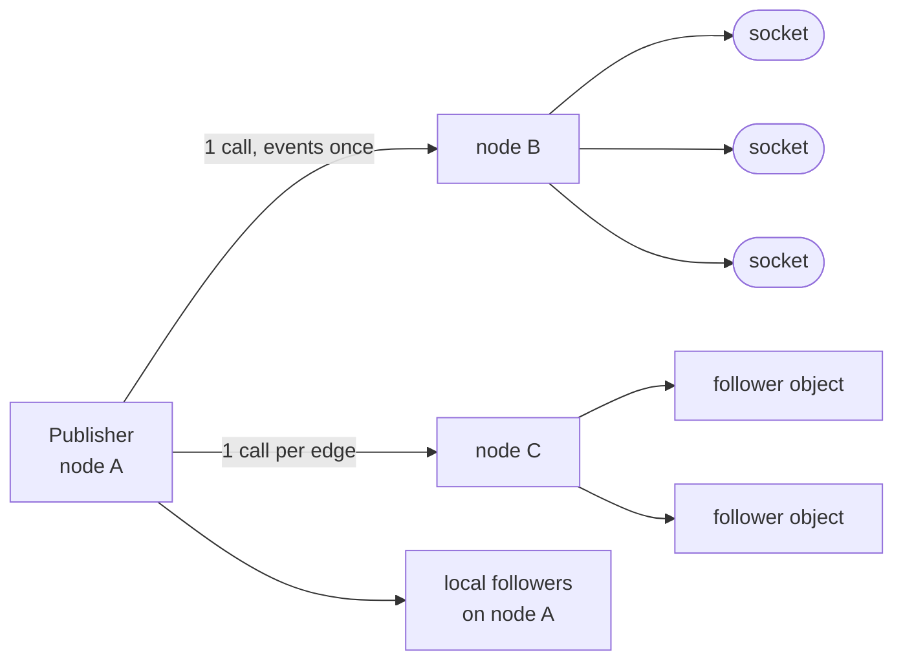
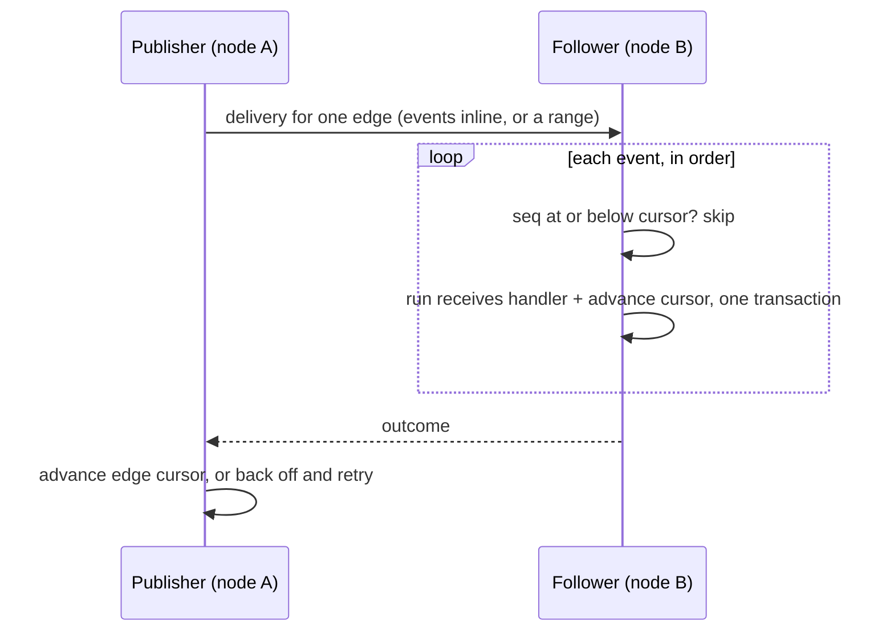

## The log and the edges

`state:publish` appends the event to a log inside the publisher's own
SQLite file, in the same transaction as the method's writes. Beside
the log sit the **edges**: one row per approved follower, each
recording the node its follower lives on.

The edge list is the access control, computed once: the `follow` hook
runs when the edge is created, never during delivery. Delivery walks
rows. A new edge starts at the log's head; nothing is replayed down it.

## Fan-out by node

Between the publisher's calls, its **pump** partitions due edges by
the follower's node. Local edges deliver directly. Remote edges batch
into one call per node.

<table>
  <thead>
    <tr><th>Edge kind</th><th>What a remote batch carries</th><th>Publish cost</th></tr>
  </thead>
  <tbody>
    <tr><td>connection</td><td>the due events once, in publish order, beside every edge on that node with its topic, cursor and filter; the receiving node slices</td><td>one call and one copy per node holding sockets</td></tr>
    <tr><td>object</td><td>one delivery per edge, with that edge's events inline up to 32 KB, else the sequence range</td><td>one call per follower object</td></tr>
  </tbody>
</table>

A channel with 5,000 live watchers spread over 8 nodes costs 8 sends
per message. A publisher with 50 object followers costs 50, because
each follower's cursor is its own.

## Connection edges

Connection edges promise at-most-once. A local follower's events are
pushed into its connection inbox of 256 items. Remote batches fan out
to the receiving node's own inboxes.

<table>
  <thead>
    <tr><th>On the receiving node</th><th>Effect</th></tr>
  </thead>
  <tbody>
    <tr><td>the inbox has room</td><td>the item lands; the program's <code>event</code> handler runs, or the platform writes the forward envelope with no vm</td></tr>
    <tr><td>the inbox is full</td><td>the delivery is refused and the publisher prunes every edge that connection holds; the socket stays open</td></tr>
    <tr><td>the socket is gone</td><td>reported back; the publisher prunes its edges</td></tr>
  </tbody>
</table>

The edge cursor advances whether or not the push landed. A miss is
not retried: anything that must survive a tab closing belongs on the
durable object one hop back.

## Durable edges

Object edges promise at-least-once delivery with exactly-once effect
on the follower's own storage. The follower keeps a **receive cursor**
per publisher and topic, checked before the handler runs and advanced
inside the handler's own transaction.

A handler that committed never runs again for that event: redelivery
after a crash skips instead of repeating. Effects that leave the
follower's transaction, a call to a third object or a kv write, are
the window the handler-side idempotence in
[guarantees](/docs/runtime/guarantees) covers.

<table>
  <thead>
    <tr><th>Failure</th><th>Effect</th></tr>
  </thead>
  <tbody>
    <tr><td>the handler throws, or runs past 10 seconds</td><td>a failed attempt; the edge backs off 500 ms, doubling</td></tr>
    <tr><td>8 failed attempts (the last wait is 32 s)</td><td>the edge is dropped</td></tr>
    <tr><td>the follower's recorded node no longer exists</td><td>not a failure: delivery routes the follower's identity to wherever it rehomed</td></tr>
    <tr><td>a connection's recorded node no longer exists</td><td>its edges are pruned; node ids never return</td></tr>
  </tbody>
</table>

## Large payloads

Events ride inline in a durable delivery up to 32 KB. Past that, the
delivery carries only the sequence range and the edge's filter, and
the receiving node materializes the events through the platform read
path: its own copy of the publisher's file, else the holder, else the
shipped replica.

Connection batches have no range form and always ride inline, which
they can afford because a node's copy is one per event however many
sockets are owed it.

## Ordering

The log has one home, so per-publisher order is global no matter which
path an event took: inline or range, local or forwarded. Events from
one publisher reach one follower in publish order; across publishers
there is no promise.

## Related

- [Streams](/docs/runtime/streams): the surface this implements.
- [Object placement](/docs/internals/placement): replicas, which serve
  the catch-up reads.
- [Guarantees and limits](/docs/runtime/guarantees): the delivery
  table with every number.
