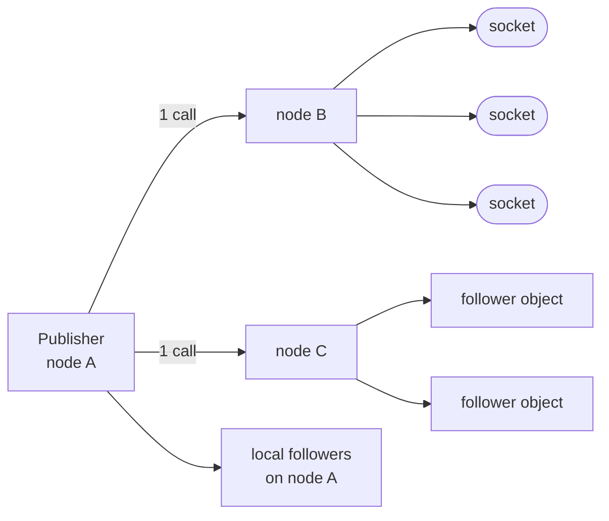
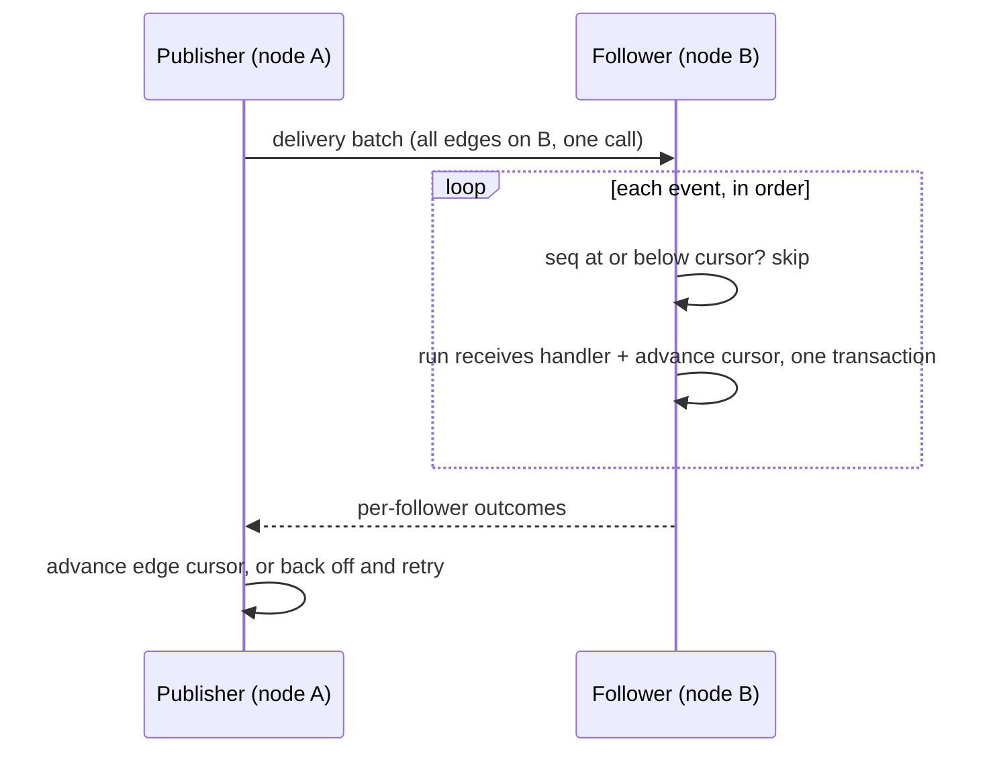

## The log and the edges

`state:publish` appends the event to a log inside the publisher's own
SQLite file, in the same transaction as the method's writes. Beside
the log sit the **edges**: one row per approved follower, each
recording the node its follower lives on.

The edge list is the access control, computed once: the `follow` hook
runs when the edge is created, never during delivery. Delivery walks
rows.

## Fan-out by node

Between the publisher's calls, its **pump** partitions due edges by
the follower's node. Local edges deliver directly. Remote edges batch
into one call per node, whatever the follower count there.

Publish cost is the number of nodes holding followers, not the number
of followers. A channel with 5,000 live watchers spread over 8 nodes
costs 8 sends per message.

## Connection edges

Connection edges promise at-most-once. A local follower's events are
pushed into its connection inbox; a full inbox (256 items) closes the
connection. Remote batches fan out to the receiving node's own
inboxes, which reports sockets that are gone so the publisher prunes
their edges.

The edge cursor advances whether or not the push landed. A miss is
not retried: anything that must survive a tab closing belongs on the
durable object one hop back.

## Durable edges

Object edges promise at-least-once delivery with exactly-once effect.
The follower keeps its own **receive cursor** per publisher and topic,
checked before the handler runs and advanced inside the handler's own
transaction.

A handler that committed never runs again for that event: redelivery
after a crash skips instead of repeating. The handler-side idempotence
asked for in [guarantees](/docs/runtime/guarantees) covers the one
remaining window, a crash after the handler's commit but before the
publisher hears about it, which redelivers and skips.

Failure keeps its per-edge shape inside a batch: each follower's
outcome maps to a cursor advance or a backoff (500 ms doubling to
60 s, 8 attempts, then the edge is dropped). A failed batch call backs
off every edge in it.

## Large payloads

Events ride inline in a batch up to 32 KB. Past that, the batch
carries only the sequence range and the edge's filter; the receiving
node materializes the events through the platform read path from
[placement](/docs/internals/placement): its own copy of the
publisher's file, else the holder, else the shipped replica.

Bytes come from the nearest copy. The publisher's node sends sequence
numbers, not payloads, for heavy traffic.

## Ordering

The log has one home, so per-publisher order is global no matter which
path an event took: inline or range, local or forwarded. Events from
one publisher reach one follower in publish order; across publishers
there is no promise.

## Related

- [Streams](/docs/runtime/streams): the surface this implements.
- [Object placement](/docs/internals/placement): replicas, which serve
  the catch-up reads.
- [Guarantees and limits](/docs/runtime/guarantees): the delivery
  table with every number.
