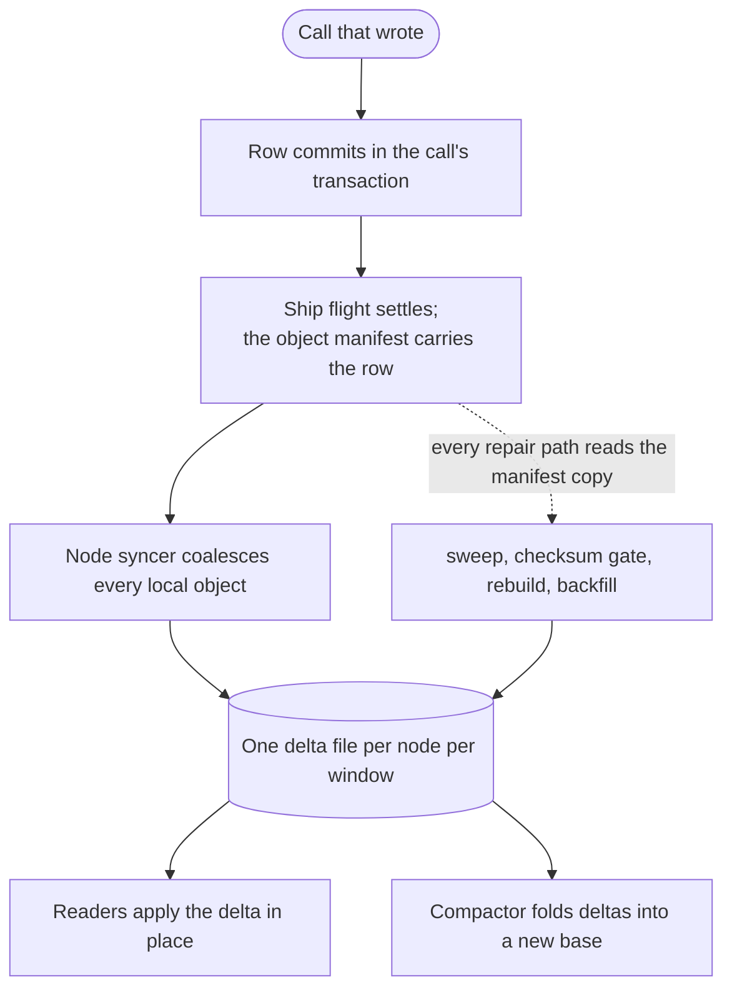
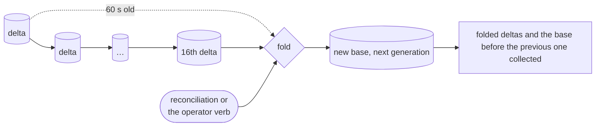
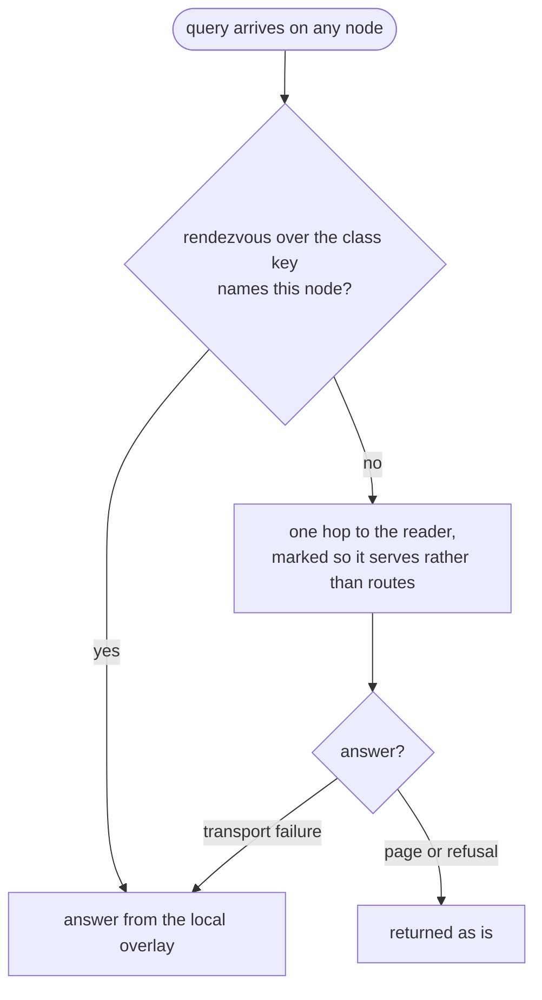

## The contract

Queries can recheck candidates against the objects themselves, so the
directory only has to be a superset of the truth.

<table>
  <thead>
    <tr><th>Failure</th><th>Cost</th><th>Verdict</th></tr>
  </thead>
  <tbody>
    <tr><td>stale row still matches</td><td>one skipped candidate on recheck</td><td>free</td></tr>
    <tr><td>row missing or lost</td><td>an object no query can ever find</td><td>fatal</td></tr>
  </tbody>
</table>

Everything below follows from that asymmetry. The write path is lazy,
coalesced, and outside every acknowledgment; the one hard job is never
losing a row.



## Declaration at publish

### The field set is data

`fields` is a table of kind markers, so the publish reads the field set
without running anything. The contract records the names and kinds.

<table>
  <thead>
    <tr><th>Refused at publish</th><th>Why</th></tr>
  </thead>
  <tbody>
    <tr><td>a class with a <code>directory</code> and neither <code>migrations</code> nor an <code>init</code></td><td>a row derives from state, and the class has no schema to hold any</td></tr>
    <tr><td>a <code>directory</code> with no fields</td><td>a listing of names is what every class already has</td></tr>
    <tr><td>a field named <code>any</code>, <code>all</code>, <code>none</code> or <code>name</code></td><td>reserved by the predicate grammar</td></tr>
    <tr><td>an empty name, a name over 128 bytes, or one containing <code>,</code> <code>:</code> <code>=</code></td><td>the name is carried in the contract's own text form</td></tr>
    <tr><td>a kind that is not one of the five</td><td><code>string</code>, <code>integer</code>, <code>number</code>, <code>boolean</code>, <code>array</code></td></tr>
  </tbody>
</table>

### dver

Every publish gives the class's field set a version, **dver**. A publish
whose field set is unchanged keeps the previous dver; a changed set takes
the next one; a class's first publish is 1. A deploy that only changes
values renumbers nothing and rebuilds nothing.

## The row

### Derived in the call's transaction

After a method that wrote returns, before its transaction commits, the
platform runs `from` and the extractors on the call's own connection.
The row lands in two reserved tables in the object's file,
`__actias_directory` and `__actias_directory_meta`, which script SQL
cannot see. It ships with the object's write-ahead log like every other
byte of state.

The derivation runs read-only: the connection's authorizer refuses any
write, and the state it sees is `name`, `sql`, `store` and `now` only.
A row identical to the last one at the same dver bumps nothing and
produces no delta, so a hot object with a stable row costs the index
nothing.

### Contained failure

`from` and each extractor are guest code the platform evaluates, so a
failure is contained, never propagated. Read-only enforcement means a
failed evaluation has nothing to roll back.

<table>
  <thead>
    <tr><th>Event</th><th>Effect</th></tr>
  </thead>
  <tbody>
    <tr><td>throws on a live write</td><td>the write commits; the row keeps its last good value plus a failed marker naming the rev and dver</td></tr>
    <tr><td>exceeds the 5 ms budget</td><td>same as a throw</td></tr>
    <tr><td>returns an undeclared field, or a value of the wrong kind</td><td>same as a throw; an integer satisfies <code>number</code>, a fraction never satisfies <code>integer</code></td></tr>
    <tr><td>the encoded row exceeds 4 KB</td><td>same as a throw; nothing is truncated</td></tr>
    <tr><td>throws during backfill</td><td>same marker, same counters</td></tr>
    <tr><td>fixed function published</td><td>the new version's backfill re-evaluates exactly the marked rows</td></tr>
  </tbody>
</table>

The budget is separate from the caller's call budget, but the
evaluation runs on the object's pinned task, so 5 ms is also the bound
it can add to the mailbox. A class with a broken function stays
findable by every last good row.

### Merge order

Rows carry `(epoch, rev, dver)` and merge last-writer-wins, compared in
that order. Deltas are an unordered bag of content-addressed files, so
this comparison is the entire ordering story.

<table>
  <thead>
    <tr><th>Component</th><th>Minted by</th><th>Settles</th></tr>
  </thead>
  <tbody>
    <tr><td><b>epoch</b></td><td>the placement sequence, at each lease claim; a delete takes the next value with its tombstone</td><td>a reborn name outranks its own gravestone; a new holder's rows beat a dead node's ghost revs</td></tr>
    <tr><td><b>rev</b></td><td>each derivation within an epoch</td><td>a later write beats an earlier one; a placeholder is rev 0 and loses to any real row</td></tr>
    <tr><td><b>dver</b></td><td>the publish that declared the field set</td><td>a backfilled row beats a manifest copy of the same state under an older declaration</td></tr>
    <tr><td>equal</td><td></td><td>equal versions carry equal rows; keeping either is correct</td></tr>
  </tbody>
</table>

A zombie ex-holder can keep uploading deltas forever. It cannot settle
new state, because the object manifest's epoch fence refuses its
flights, so its rows describe old durable states and lose on epoch.

## The syncer

One syncer per node, not per object. It collects the rows of every
settled flight on the node and flushes them as one delta every
`DIRECTORY_FLUSH_MS` (200 ms), which is the coalescing window and
therefore the floor of the freshness window.

Every settled flight offers the row its manifest carries, at the
flight's epoch, so a row is emitted only after the state it describes
is durable. The index describes durable states only; a crash cannot
leave it describing a state that was rolled back.

A delta that fails to upload keeps its rows for the next flush. A row
that cannot be encoded is dropped from the flush with a log line rather
than retried forever, and the next repair pass re-offers it.

## The files

Per class, in the blob store:

```
directory/{project}/{class}/manifest.json
directory/{project}/{class}/bases/b-{hash}.sqlite
directory/{project}/{class}/deltas/d-{hash}.sqlite
```

Every base and delta is immutable and named by its content hash. The
manifest is the only mutable key, and only the compactor writes it.
The layout is one base plus a bag of unfolded deltas; nothing is
sharded.

Four loops put deltas: the syncer, the backfill, the crash sweep and
the operator rebuild. Content addressing is what makes node identity
irrelevant: a retried upload is idempotent, a duplicate delta is
absorbed, and no name collision can corrupt anything.

## The compactor

### Fold cadence



Readers apply deltas themselves, so a fold is not what makes rows
visible. The compactor checks every `DIRECTORY_COMPACT_SECS` (10 s)
and folds when sixteen deltas have gathered or the oldest is a minute
old. A fold rewrites the whole base, about a kilobyte per row, so a
class of 100k rows is a 100 MB put; the cadence exists to make that
rare. The fold a reconciliation pass or an operator asks for runs at
once.

### What a fold records

The manifest names the base, its generation, the folded deltas, the
row count, the identity checksum, the lowest dver any row carries, and
the field declarations observed. The lowest dver is what tells a
reader which fields are still building.

### Fencing and garbage

A fold runs under the class's compaction lease. Writing the manifest
rereads the current one and refuses if its generation moved, so a
compactor that lost its lease cannot overwrite a newer fold; the lease
is the serializer, the generation check the second guard. After a fold
the folded deltas and any base older than the previous generation are
collected, leaving one generation of rollback margin.

## The overlay

### Reader placement



Each class has a reader: the live node that wins a rendezvous hash
over the class key, the same choice reconciliation makes for its
owner. Membership is cached for ten seconds, so a query costs no
registry read. A refusal from the reader is the caller's answer; any
other failure answers locally, so placement is a preference and never
a dependency.

### Build once, apply in place

The reader keeps a local overlay per class: the base restored once per
generation, then every delta that arrives in that generation applied
in place, which costs the delta's rows rather than the class's. Applies
are upserts guarded by the merge order in SQL, so applying one twice
changes nothing and at-least-once delivery is safe.

The overlay is built beside its name and renamed into place, kept in
WAL mode, with one indexed column per field generated from the
manifest's field order. A query never sees a half-built file and never
waits on an apply. An apply that fails for any reason falls back to a
full build.

An overlay idle for `DIRECTORY_OVERLAY_TTL_SECS` (1800 s) is evicted
and its file removed. It is a pure cache, so eviction costs the next
query a build and never costs correctness.

### Query translation

The wire carries a tree of names, operators and values, never SQL. The
translation binds every value as a parameter, refuses an unknown
operator rather than dropping it, and appends `name` as the final sort
key so the order is total. Absent values sort last in both directions.

The cursor is keyed on the instance name alone, not the sort tuple: a
name cannot change under a page, a sort value can. The cost is a page
boundary that repeats or skips a row whose sort value moved, which is
the staleness the index already has.

### The declared view

A field published a second ago has no row carrying it yet. At query
time the reader folds the owner's current contract into the manifest
it reads, so the field exists with a dver above every row's, which is
what "building" means. The same view is what starts the backfill for a
class that has had no writes since the publish.

## Repair and reconciliation

<table>
  <thead>
    <tr><th>Mechanism</th><th>Trigger</th><th>Cost</th></tr>
  </thead>
  <tbody>
    <tr><td>re-offer on settle</td><td>every settled flight</td><td>free, rides the flight</td></tr>
    <tr><td>crash-scoped sweep</td><td>a node left without a clean drain; checked every <code>DIRECTORY_SWEEP_SECS</code> (15 s)</td><td>one manifest read per object the dead node held</td></tr>
    <tr><td>identity checksum gate</td><td>every reconciliation pass, <code>DIRECTORY_REBUILD_SECS</code> (900 s)</td><td>one manifest read per owned class and one count rpc per scope; a walk only when they disagree</td></tr>
    <tr><td>full rebuild</td><td><code>actias objects &lt;project&gt; rebuild &lt;class&gt;</code></td><td>one manifest read per object in the class</td></tr>
    <tr><td>backfill</td><td>rows below the declared dver, inside the reconciliation pass</td><td>one scratch restore per object, 256 per class per pass</td></tr>
  </tbody>
</table>

The object's shipping manifest carries the current row, so every
mechanism above but the backfill is a metadata copy: nothing restores
an object's file or starts a vm. The two exceptions are the backfill
and the verified read's scratch tail, both below.

### Re-offer on settle

A flight is write-triggered, so a new residency heals its rows on its
first write, not on arrival. An object that never writes again is
healed by the sweep or the gate, which is why both exist.

### The sweep and the rebuild disagree on purpose

The sweep writes deltas with no field declaration attached: guessing
one would let a repair rewrite a class's field set. The operator
rebuild attaches the owner's current declaration, because losing the
manifest loses the field set and the rebuild is the one path meant to
restore it.

### The gate

Each class is checked by one node per pass, the rendezvous winner for
that era, so a wedged node cannot strand its share for long: the salt
rotates. The check compares the manifest's identity checksum with the
placement store's; a match costs nothing more, a mismatch walks the
manifests.

### Placeholders

An identity the placement store knows but no manifest carries a row
for (never shipped, or shipped before its class had a directory) is
indexed as an empty row at rev 0: "exists, never derived" in the
index's own vocabulary. The checksum then matches by construction, the
object's first real derivation outranks the placeholder on rev, and
the dver floor and the backfill both skip rev 0, since there is no
state to re-derive.

### The backfill

The backfill runs inside the reconciliation pass, under the compactor's
lease, before the fold. It takes the rows below the declared dver,
oldest dver first so the floor moves, skipping tombstones and
placeholders. Each object is restored to scratch and evaluated in one
reused vm, sequentially, 256 per class per pass; the pass then asks
for a fold so the manifest's floor advances.

## Verified reads

`visit` checks each candidate against its object without waking it.

### The metadata ladder

The common path restores nothing. The reader fetches the object's
shipping manifest (eight at a time) and decides from `(epoch, rev,
dver)` alone: an equal version verifies the row as served; a newer
settled row is rechecked in memory from the manifest's own pairs and
served fresher than the index had it; a deleted object is dropped.

### The scratch tail

A candidate whose newest derivation failed cannot be judged from
metadata. Its shipped state is restored to a scratch copy, the class's
migration ladder is applied there, and the declaration is evaluated
read-only. Migrations are deterministic over data that is not changing,
so the scratch result equals what first touch will produce; nothing
durable advances.

At most sixteen recomputes run per page; the rest come back flagged
`unverified`, with a message saying so, and are checked as the page is
walked again. Recomputes are memoized by the failing `(object, rev,
dver, epoch)`, up to 4096 entries, so a console refreshing over a
broken class does not storm the store.

## Metrics

Every loop above counts itself at the worker's `/_metrics`, under
`actias_directory_*`.

<table>
  <thead>
    <tr><th>Loop</th><th>Series</th></tr>
  </thead>
  <tbody>
    <tr><td>syncer</td><td><code>flushes_total</code>, <code>flushed_rows_total</code>, <code>flush_failures_total</code></td></tr>
    <tr><td>compactor</td><td><code>folds_total</code>, <code>fold_failures_total</code></td></tr>
    <tr><td>gate</td><td><code>passes_total</code>, <code>gate_checks_total</code>, <code>gate_opened_total</code></td></tr>
    <tr><td>rebuild and sweep</td><td><code>rebuilds_total</code>, <code>rebuilt_rows_total</code>, <code>placeholder_rows_total</code>, <code>rebuild_failures_total</code>, <code>sweeps_total</code>, <code>swept_rows_total</code></td></tr>
    <tr><td>backfill</td><td><code>backfilled_rows_total</code>, <code>backfill_skipped_total</code>, <code>backfill_remaining</code></td></tr>
    <tr><td>overlay</td><td><code>overlay_builds_total</code>, <code>overlay_build_ms_total</code>, <code>overlay_applies_total</code></td></tr>
    <tr><td>placement</td><td><code>forwarded_total</code>, <code>served_for_peer_total</code></td></tr>
    <tr><td>verified reads</td><td><code>visit_verified_total</code>, <code>visit_recomputed_total</code>, <code>visit_flagged_total</code>, <code>visit_dropped_total</code></td></tr>
    <tr><td>files</td><td><code>file_reads_total</code>, <code>file_fetches_total</code>, <code>refusals_total</code></td></tr>
  </tbody>
</table>

A healthy cluster reads as gate checks climbing while gate openings do
not, and file reads climbing while fetches do not.

## Knobs

<table>
  <thead>
    <tr><th>Variable</th><th>Default</th><th>Meaning</th></tr>
  </thead>
  <tbody>
    <tr><td><code>DIRECTORY_FLUSH_MS</code></td><td>200</td><td>the syncer's coalescing window</td></tr>
    <tr><td><code>DIRECTORY_COMPACT_SECS</code></td><td>10</td><td>how often the compactor checks the fold cadence</td></tr>
    <tr><td><code>DIRECTORY_REBUILD_SECS</code></td><td>900</td><td>the reconciliation pass, gate and backfill included</td></tr>
    <tr><td><code>DIRECTORY_SWEEP_SECS</code></td><td>15</td><td>how often departures are checked for a crash sweep</td></tr>
    <tr><td><code>DIRECTORY_OVERLAY_TTL_SECS</code></td><td>1800</td><td>idle time before an overlay leaves the disk</td></tr>
    <tr><td><code>DIRECTORY_CACHE_MB</code></td><td>256</td><td>the content-addressed file cache</td></tr>
    <tr><td><code>DIRECTORY_EVAL_BUDGET_MS</code></td><td>5</td><td>compute per derivation</td></tr>
  </tbody>
</table>

## What a crash costs

<table>
  <thead>
    <tr><th>Event</th><th>Directory effect</th></tr>
  </thead>
  <tbody>
    <tr><td>node dies before delta flush</td><td>rows late until the next write, the sweep or the gate; never lost</td></tr>
    <tr><td>blob write retried</td><td>same content hash, idempotent</td></tr>
    <tr><td>compactor dies mid-fold</td><td>manifest unwritten; the next fold redoes it</td></tr>
    <tr><td>reader dies</td><td>the next query lands on the next rendezvous winner, which builds its own overlay</td></tr>
  </tbody>
</table>

Every row in this table is a lateness. The design has no event whose
effect is a loss.

## Related

- [Directory](/docs/runtime/directory): the query surface this
  machinery serves.
- [Object placement](/docs/internals/placement): leases, epochs, and
  the shipping pipeline the rows ride.
- [Event delivery](/docs/internals/delivery): the other per-node
  fan-out, for streams.
