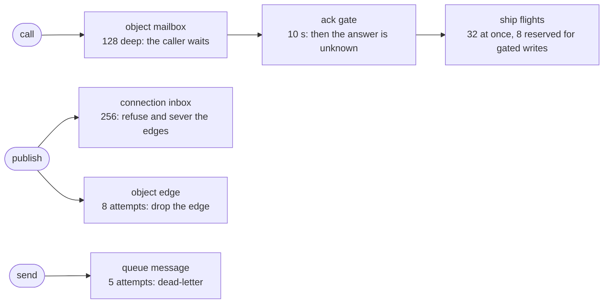

## Per surface

<table>
  <thead>
    <tr><th>Surface</th><th>Scales with</th><th>Serializes at</th></tr>
  </thead>
  <tbody>
    <tr><td>HTTP request</td><td>worker count, stateless</td><td>nothing</td></tr>
    <tr><td>Object call</td><td>instance count</td><td>the instance's home task</td></tr>
    <tr><td>Object first touch</td><td>one placement-store claim</td><td>the placement store; the holder cache absorbs repeats</td></tr>
    <tr><td>Database <code>read</code>, <code>read_one</code></td><td>worker count, via replicas</td><td>nothing</td></tr>
    <tr><td>Directory query</td><td>class count; one reader per class</td><td>the class's reader node</td></tr>
    <tr><td>Publish</td><td>nodes holding followers, plus one per object follower</td><td>the publisher's pump</td></tr>
    <tr><td>KV</td><td>the kv store (Postgres, or ScyllaDB at volume)</td><td>nothing</td></tr>
    <tr><td>Queue message</td><td>queue count</td><td>the queue's home task, 16 messages per firing</td></tr>
  </tbody>
</table>

## The unit of serialization

The object instance. One task runs its calls one at a time, which is
what makes its transactions and its event log trivial; the price is
that one instance is bounded by one core and one file.

A hot instance is therefore a modelling problem, not a tuning
problem. Split hot state across instances: a `Channel` per room
rather than one router object, a counter per shard rather than one
global counter.

## What one node absorbs

- Followers: delivery cost is per node for sockets, so co-located
  sockets are nearly free. See [event delivery](/docs/internals/delivery).
- Database reads: `read` and `read_one` answer from a replica without
  touching the home. Every object method reaches the home. See
  [placement](/docs/internals/placement).
- Scripts: pointer and blob caches keep the steady state node-local.
  See [the cluster](/docs/internals/topology).
- Misrouted object calls: the holder cache forwards them from memory;
  the placement store is consulted on first touch and after a home
  moves, not per call.

## Where each queue is bounded

<table>
  <thead>
    <tr><th>Bound</th><th>At</th><th>Behaviour</th></tr>
  </thead>
  <tbody>
    <tr><td>object mailbox</td><td>128 calls</td><td>backpressure: the caller waits, nothing is dropped</td></tr>
    <tr><td>ack gate</td><td>10 s (<code>OBJECT_ACK_GATE_MS</code>)</td><td>a written call answers "outcome unknown"; the write keeps trying to ship</td></tr>
    <tr><td>ship concurrency</td><td>32 flights, 8 reserved (<code>OBJECT_SHIP_CONCURRENCY</code>, <code>OBJECT_SHIP_RESERVED</code>)</td><td>flights a caller is waiting on always find a slot</td></tr>
    <tr><td>connection inbox</td><td>256 items</td><td>deliveries: refused and the edges severed; client frames: the wire closes</td></tr>
    <tr><td>object edge</td><td>8 attempts, 500 ms doubling</td><td>the edge is dropped</td></tr>
    <tr><td>queue message</td><td>5 attempts, 2 s doubling to 1 h</td><td>dead-lettered</td></tr>
  </tbody>
</table>

The platform sheds at the edges and blocks in the middle: the one
bound that waits rather than drops is the mailbox, because a call has
a caller to answer.

## Related

- [Event delivery](/docs/internals/delivery): the fan-out mechanics.
- [Object placement](/docs/internals/placement): homes, replicas, and
  recovery.
- [Guarantees and limits](/docs/runtime/guarantees): the numbers.
