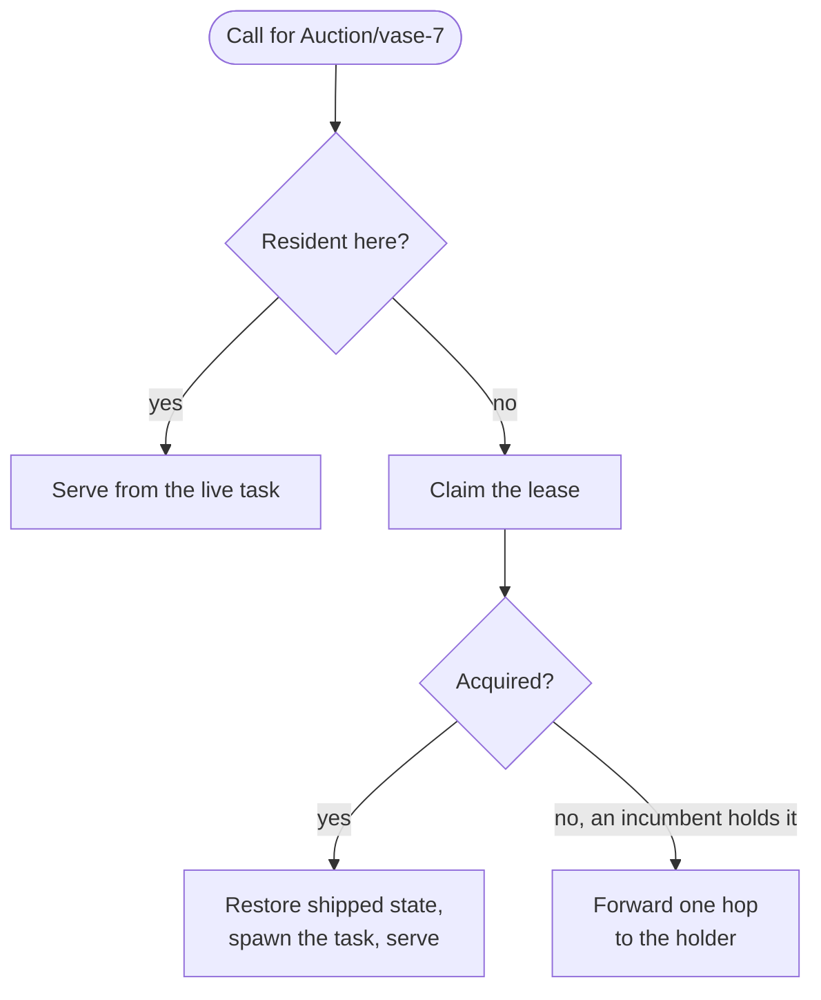
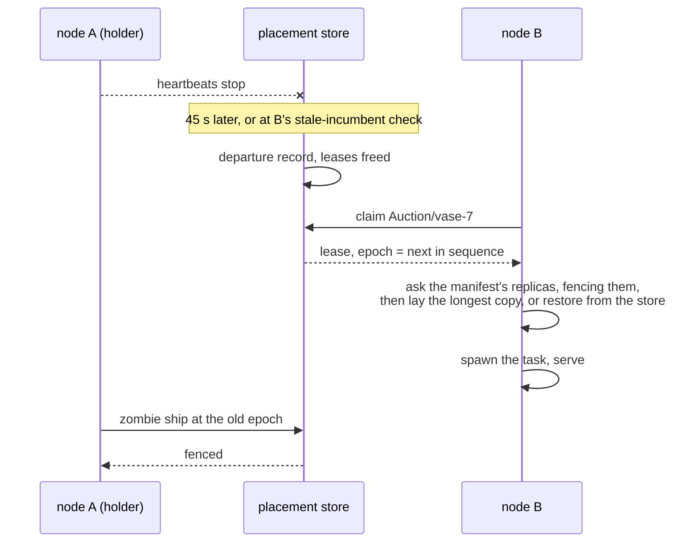
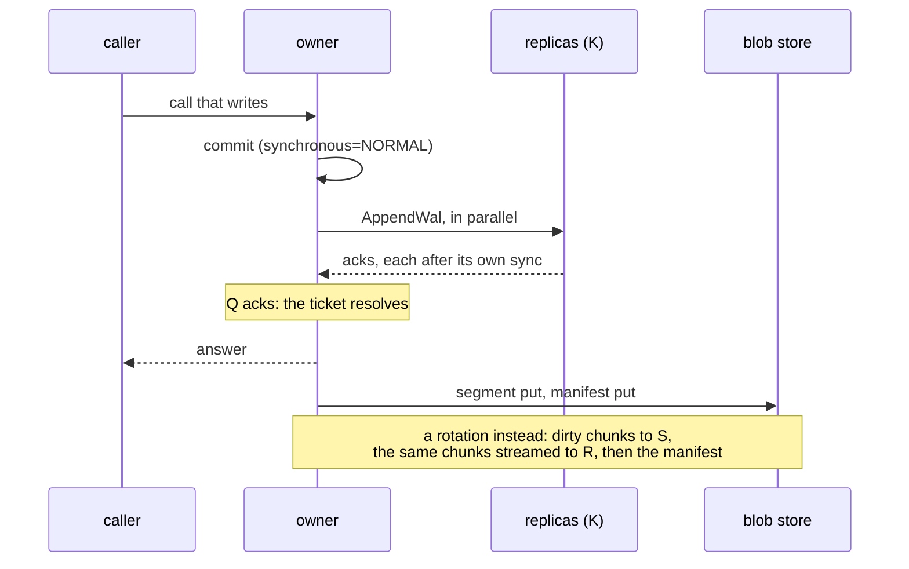
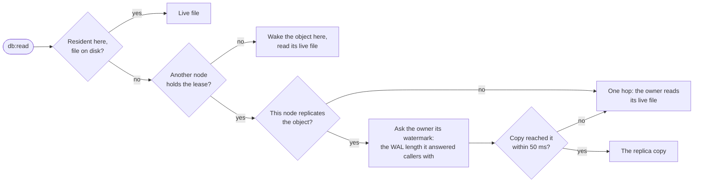

## Identity and home

An object's identity is the triple (scope, class, name). Its
platform-wide id is the blake3 hash of that triple; the scope is the
project for resource classes and the script for cron schedules.

An object lives on exactly one node at a time: the **lease holder**.
The first call to a non-resident object claims the lease for the node
the call landed on, so objects home where their traffic arrives.

### The region

Every project has a home region, recorded when it is created (the
region of the ingress that received the request, else the control
plane's own). A class may pin its instances to another region by
declaration, `placement = { region = "eu-west" }`, which `actias
check` validates. An object is **born** in the class's pinned region
or, without a pin, the project's home; every caller computes that
from the class and the project, which it already holds, so no
service is asked where an object is.

A call that lands in another region forwards once to the object's
region and answers over the same connection. The promise is simple:
an object is fast from its own region and one hop slower from any
other. A region the control plane has not registered is served where
the call landed rather than failed.

The platform may later move an object away from its birth region.
When it does, the birth region's placement store keeps one
forwarding row for it; a caller that goes there learns the region
from the answer, remembers it, and forwards once more. Names never
encode a region: the name is yours, the placement is the platform's.

### Moving a project

A project moves between regions as a job, not a migration, because
its bytes live in a bucket and its homes are leased caches: the
control plane marks the project moving, waits for the old region's
residencies to end, copies the project's object prefixes and
directory between the two regions' storage with each object's
manifest last, repeating until a pass finds nothing new, flips the
home, and clears the mark. Calls during the move are
refused with a retryable answer, "the project is moving between
regions", so a caller retries rather than losing anything; every
write answered before the move is present after it. The console's
policy page follows the move; `GET /project/:id/move` is its source.

## Leases and epochs

<table>
  <thead>
    <tr><th>Rule</th><th>Number</th></tr>
  </thead>
  <tbody>
    <tr><td>a lease lives exactly as long as its holder stays in the node registry; there is no per-lease clock</td><td>a node ages out after 45 s without a heartbeat (<code>NODE_TTL_SECS</code>)</td></tr>
    <tr><td>a claim against a dead holder frees the lease and wins; recovery is the same path as first placement</td><td></td></tr>
    <tr><td>a graceful shutdown deregisters at the signal, freeing every lease at once; a crash waits for age-out, and calls forwarded to the dead node fail until then</td><td>45 s at most</td></tr>
    <tr><td>a resident object refreshes its claim on a call, throttled</td><td>once per 10 minutes</td></tr>
    <tr><td>every claim draws the object's <b>epoch</b> from one cluster-wide sequence; a delete takes the next value with its tombstone</td><td></td></tr>
    <tr><td>a cold object's first call goes to a live node its manifest names as a replica, so it wakes on its own bytes; a node that is itself a replica claims at once</td><td>one hop at most</td></tr>
    <tr><td>a replica copy the store covers entirely leaves the disk once idle (a deleted object's copy leaves with its fence)</td><td>1800 s (<code>OBJECT_REPLICA_IDLE_SECS</code>)</td></tr>
  </tbody>
</table>

## Durability

Writes mark the object dirty and one background flight per object
carries the committed write-ahead log frames since the last flight,
coalescing bursts, to two places: the object's **replicas** and the
blob store.

The base is the object's file at a checkpoint, kept as a list of 1 MiB
chunks named by their content hash. Every frame in the write-ahead log
names the page it carries, so when the log folds into the file the
owner knows which chunks changed without reading the rest, and a
rotation costs what was written, not what is stored. A replica holds
the assembled file and patches it in place from the same chunks. A
node laying the file from the store fetches the chunks it lacks in
parallel, through a cache keyed by hash, so a copy it recently held is
mostly already there.

<table>
  <thead>
    <tr><th>What ships</th><th>When</th></tr>
  </thead>
  <tbody>
    <tr><td>the main file at a checkpoint, as the generation's base, in 1 MiB chunks named by their hash</td><td>the first flight of a residency ships every chunk; each rotation ships only the chunks the folded frames touched, and replicas receive the same delta and patch their copy in place</td></tr>
    <tr><td>the write-ahead log frames since the last flight</td><td>every other flight; the cost follows the delta, not the database</td></tr>
    <tr><td>a fresh base</td><td>the log passes 4 MB, an eighth of the base, or 64 segments (<code>OBJECT_WAL_ROTATE_KB</code>, <code>OBJECT_WAL_ROTATE_FRACTION</code>, <code>OBJECT_MAX_SEGMENTS</code>)</td></tr>
  </tbody>
</table>

<table>
  <thead>
    <tr><th>Knob</th><th>Default</th><th>Meaning</th></tr>
  </thead>
  <tbody>
    <tr><td><code>OBJECT_REPLICAS</code></td><td>3</td><td>live nodes an owner fans out to, chosen by rendezvous over the object id; fewer when fewer exist, none on a single node</td></tr>
    <tr><td><code>OBJECT_QUORUM</code></td><td>2</td><td>acks that answer the call; 0 keeps the store's manifest as the answer and runs the fan-out in shadow</td></tr>
    <tr><td><code>OBJECT_REPLICA_SYNC</code></td><td><code>fsync</code></td><td>a replica syncs its WAL before acking, batched across every append that arrived together; <code>os</code> acks from the page cache</td></tr>
    <tr><td><code>OBJECT_ACK_GATE_MS</code></td><td>10000</td><td>longest a written call waits for its quorum or, failing that, the store</td></tr>
  </tbody>
</table>

A flight that misses its quorum still lands on the store and answers
at the manifest, as a single node always does. The replica fence and
the manifest epoch both refuse a zombie ex-holder: a replica that has
seen a newer epoch refuses its appends, and the store refuses its
manifest. A graceful stop flushes dirty objects before the process
leaves, within a budget of 50 ms per dirty object.

A claim lays the object's file from the freshest copy it can prove.
It asks the replicas the manifest names, raising their fences to the
new epoch, and once a quorum has answered it takes the longest copy,
provided it is at least as long as what the store holds; otherwise it
assembles the file from the store's chunks and logs a durability
incident. With two of
three replicas answering, any two quorums share a replica, so every
acknowledged write is in the longest copy. A sidecar records the
epoch of the node's last residency, so a node returning to an object
it hosted long ago cannot serve stale state.

## Database reads from anywhere

`db:read` and `db:read_one` on a [database](/docs/reference/database)
do not need the home. Every object method, and every `query`, goes to
the home. A read is answered from the nearest copy, in this order:

A read on any node sees every write a caller was told succeeded
before the read began. A node that replicates the object asks the
owner for its **watermark**, the WAL length its last released flight
reached, and serves its own copy once the copy has reached it; the
append carrying it is already on its way, so the wait is the tail of
one round trip. A node holding no copy forwards the read to the owner.
A request that has already called the object reads it at the owner
without asking. Reads scale with the number of nodes; writes serialize
at the one home. The store's copy, refreshed every 30 seconds
(`OBJECT_REPLICA_TTL_SECS`), serves only the console's reads on a node
holding nothing.

## Serialized calls

One task per resident object runs its calls one at a time, in arrival
order, with a mailbox of 128 waiting calls behind it. That is the
"once, serialized" promise in [guarantees](/docs/runtime/guarantees).
Between calls, the object's delivery pump runs; see
[event delivery](/docs/internals/objects/delivery).

## Alarms

An armed alarm is mirrored to the placement store off the call's
transaction, retried three times. Every node sweeps the mirror every
30 seconds (`OBJECT_SWEEP_SECS`), 256 rows per pass, and re-mirrors
every alarm on its own disk once at boot. Waking an object is claiming
it, so an alarm whose home died fires on whichever node sweeps it
first.

Because the mirror write is asynchronous, a rolled-back arm can leave
a spurious row. The cost is one wasted wake: the object's own storage
is the truth the wake checks against.

## Related

- [The cluster](/docs/internals/cluster/topology): node membership, which
  leases hang off.
- [Objects](/docs/runtime/objects): the user-facing surface this
  machinery hosts.
- [Guarantees and limits](/docs/runtime/guarantees): failure behaviour
  as a promise.
