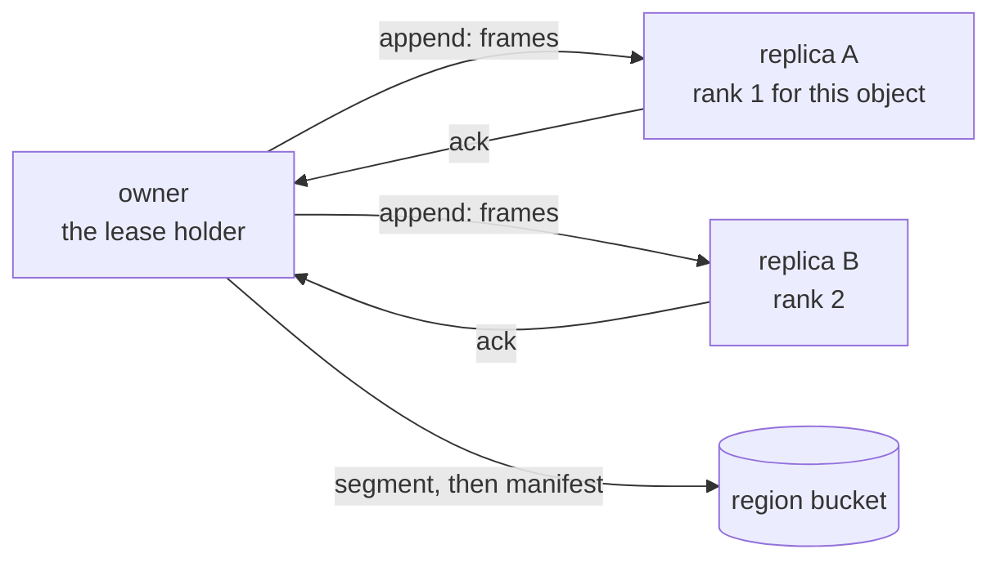

An object's writes are acknowledged on a quorum of replica nodes
before the bucket has them. What a replica is, what crosses the
wire, how the set changes, and how a takeover finds the freshest
bytes.

## The replica set

When an object becomes resident, its owner picks `OBJECT_REPLICAS`
minus one other live nodes by rendezvous hashing over the object id
and the node id: every node computes the same ranking from
membership alone, so two owners of the same object in succession
mostly agree and a node leaving moves only the objects it
replicated. The set is recorded in the object's manifest with every
flight, so a takeover knows who to ask.

Replica choice is made per residency and repaired on failure, never
rebalanced on its own: churn elsewhere does not shuffle every
object's copies.

The quorum of acks releases the callers; the bucket write completes
behind it.

## A flight, on the wire

A flight carries WAL frames: the bytes SQLite appended since the
last flight. To each replica it sends an **append** naming the
object, the owner's epoch, the generation it belongs to, and the
frames. The replica checks three things before it writes:

1. **The epoch.** A replica remembers the highest epoch it has seen
   for the object. An append under a lower epoch is refused as
   fenced: a zombie owner cannot land a frame anywhere a quorum
   counts.
2. **The generation.** A generation is a base (a snapshot of the
   file) plus the WAL that follows it. A replica that has no copy of
   the generation, because it is new to the set, asks for the whole
   generation instead of the delta; the owner lays it, chunk by
   chunk, on the next flight.
3. **The length.** Frames are idempotent by offset. A replica that
   missed a flight reports its length and the owner resends from
   there; a replica that already has the frames acknowledges again.

The replica fsyncs (`OBJECT_REPLICA_SYNC`, `fsync` by default) and
acknowledges. The owner counts acknowledgments; at the quorum it
releases every ticket the flight covers; stragglers get a short
grace and are then resent next flight.

## When a replica dies

Its appends fail. The flight still releases on the quorum. After the
flight answers, never before, the owner repairs the set: a member
the membership snapshot no longer lists leaves it, a set short of
its size takes the best-ranked live node it lacks, and a join forces
the next flight to rotate, so the newcomer receives a whole
generation rather than a delta it cannot apply. Membership is the
shared ten-second snapshot every node keeps; no flight reads the
placement store.

## Rotation

A generation cannot grow forever. When its WAL passes
`OBJECT_WAL_ROTATE_KB` or a fraction of the base
(`OBJECT_WAL_ROTATE_FRACTION`) or `OBJECT_MAX_SEGMENTS` segments,
the next flight rotates: the owner checkpoints the file, snapshots
it as content-addressed chunks, lays the new base on every replica
and in the bucket, and starts a fresh WAL. A rotation is the one
flight that carries a whole file; everything else is a delta.

## Takeover

The owner dies. Its lease ages out of the placement store after
`NODE_TTL_SECS` of silence, or is freed at once by a graceful
deregister. The next call for the object, anywhere, claims the
lease, and the claimant must find the freshest bytes.

It reads the manifest from the bucket, which names the last
generation the bucket has and the replica set. Then it asks each
listed replica what it holds: the epoch, the generation, the WAL
length. The rule:

- a live replica whose copy is of the manifest's generation and at
  or past the bucket's length wins; the claimant copies its file
  and WAL over the data plane and continues from there, without
  touching the bucket's segments;
- otherwise the bucket is the source: base chunks by hash, segments
  in order, checkpointed into a fresh file.

The claimant's epoch is minted above everything the identity ever
held, so its first flight fences any replica still holding the dead
owner's frames, and its manifest write fences the bucket.

A takeover that finds fewer live replicas than the quorum logs a
durability incident: the acknowledged writes it can prove are the
ones a replica held; anything acknowledged by a quorum that has
since died is the loss the guarantees page bounds.

## Replica reads

A node that holds a copy of an object may answer a `read` for it
without forwarding, once the owner has vouched: the reader asks the
owner for its watermark, the length the owner has acknowledged as
durable, and serves from its copy only when the copy is at or past
it, waiting up to 50 ms for the frames already in flight to arrive.
Otherwise the read forwards to the owner. A read never needs the
bucket and never needs a lease.

## Footprint

A replica holds a base plus WAL per object it replicates: cluster
storage for warm objects is the replica count times the object,
plus the bucket's copy. An idle replica copy leaves the disk after
`OBJECT_REPLICA_IDLE_SECS`; the bucket has everything, and the next
residency lays a fresh copy on its first flight.
