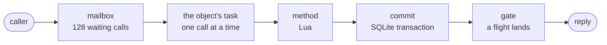

One call to an object that writes, and one that does not, from the
mailbox to the reply. The numbers named are settings; everything
else is fixed.

## The call arrives

A unit calls `Auction("lot-42"):bid("ada", 25)`. The worker that runs
the unit resolves the object's home ([placement](/docs/internals/objects/placement)):
resident here, forward one hop, or claim. On the home node the call
enters the object's **mailbox**, a queue of at most 128 waiting
calls in arrival order, drained by the object's one task. The task
runs one call at a time, to completion, before the next. An object has no
concurrency.

## The transaction

Before the method runs, the task opens a transaction on the object's
SQLite file. Every `state.sql` and `state.store` operation inside
the method rides that transaction. When the method returns, the task
commits; when it throws, the task rolls back and the reply is the
error. A method's writes are therefore atomic with respect to each
other and with respect to the reply: a caller never sees half of
them, and a rolled-back method wrote nothing.

The file runs with `synchronous=NORMAL`. A commit reaches the file's
WAL and not necessarily the disk. That is deliberate: the local file
is not the durability point, the ship is, and paying for an fsync on
a file that a lease may take away is paying twice.

## The directory row

If the class declares a `directory`, the task derives the object's
row from its state inside the same transaction, before the commit,
so the row and the state it describes can never disagree. A
derivation that fails (throws, blows its 5 ms budget, produces a row
the kernel refuses) keeps the last good row and marks the failure;
it never fails the write. A derived index may not veto a business
write ([the directory](/docs/internals/objects/directory)).

## The write gate

After the commit the task asks the object's **shipper** for a
ticket. The shipper is one per resident object; it owns the file's
checkpoints and ships what changed. The ticket resolves when a
**flight** covering the write has landed.

A flight is one round of shipping: the shipper reads the WAL frames
that appeared since the last flight (a delta, not the file), fans
them out to the object's replica nodes, and writes them to the
region's bucket as a WAL segment behind a manifest. Coverage is by
flight number, not by byte offset: a ticket taken while flight N is
still running is covered by flight N+1, which had not started reading
the file when the ticket was taken. The ticket can wait one flight too many, never one too few.

The flight **releases** the tickets it covers at the earlier of two
moments:

- a quorum of the object's replicas has acknowledged the frames
  (`OBJECT_QUORUM`, 2 of 3 by default), or
- the manifest naming the segment is written to the bucket.

With replicas the first comes in a few milliseconds; the bucket
write then completes in the background. With no replicas (a single
node) the manifest is the release, which is the in-cluster store's
round trip, tens of milliseconds.

The reply leaves when the ticket resolves. The task does not wait:
it hands the ticket and the result to a side task and takes the
next call from the mailbox. That is what keeps the gate a latency
cost rather than a throughput cost: ten writes in a burst commit one
after another, ride one flight, and release together. Ordering is
the mailbox's property and is untouched by answering out of order.

A ticket that does not resolve within `OBJECT_ACK_GATE_MS` (10 s)
fails the reply with a typed unknown outcome. The write is still
committed locally and the shipper keeps retrying; the caller is
told the outcome is unknown.

## The read gate

A method that wrote nothing has no ticket of its own. It still
cannot be answered freely: the object may have writes from earlier
calls whose flights have not landed, and a reply computed over them
would describe state a crash could take back. So the task asks the
shipper a cheaper question: is anything dirty or flying? If not,
which is the common case, the reply leaves at once. If so, the reply
waits behind the flight that will carry the rest, exactly as a write
would, and for the same bound.

The same rule holds for database reads that skip the mailbox. A
`read` on a resident object is served from the object's own file
without entering the queue, and before it is answered the worker
asks the object's shipper the same question. A read served from a
replica copy on another node waits for the copy to reach the
owner's watermark instead, which is the same fact by another route.

Nothing outside an object learns of state that is not yet durable,
whoever wrote it and whoever asked ([guarantees](/docs/runtime/guarantees)).

## A request's writes, together

A unit that calls several objects would pay one gate per call. It
does not: a request's calls are made in deferred mode, each reply
comes back with its ticket unsettled, and the request settles every
ticket in one wait before its response leaves the machine. One wait
for a chain of writes. A later read in the same request of an object
it already called goes to that object's mailbox, never to a replica
copy, so a request reads its own writes on whatever node it landed.

## Shipping, bounded

A node ships every dirty object, and a node with many dirty objects
would open one flight per object. Flights take a permit from a
node-wide pool (`OBJECT_SHIP_CONCURRENCY`, 32) with a reserved lane
(`OBJECT_SHIP_RESERVED`, 8) for flights a caller is waiting on, so
background shipping is the first to wait. A shipper whose flights keep
failing backs off and stops after six consecutive failures, leaving
the object dirty; the next write re-arms it, and the drain at
shutdown flushes it.

## What a crash loses

<table>
  <thead>
    <tr><th>Moment of the crash</th><th>Acknowledged writes</th><th>Unacknowledged</th></tr>
  </thead>
  <tbody>
    <tr><td>after the commit, before the flight</td><td>none lost: no reply was sent</td><td>the call's outcome is unknown; its writes are in the local file and ship on takeover if a replica has them, else they are lost</td></tr>
    <tr><td>after a quorum acknowledged, before the manifest</td><td>none lost: the replica has the frames, takeover restores from it</td><td>as above</td></tr>
    <tr><td>after the manifest</td><td>none lost</td><td>none</td></tr>
  </tbody>
</table>

The crash drill in the repository kills a worker at each of these
points and checks the table above after takeover.
