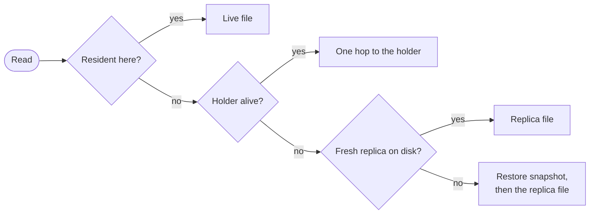

## Identity and home

An object's identity is the triple (scope, class, name). Its
platform-wide id is the blake3 hash of that triple; the scope is the
project for resource classes and the script for cron schedules.

An object lives on exactly one node at a time: the **lease holder**.
The first call to a non-resident object claims the lease for the node
the call landed on, so objects home where their traffic arrives.

## Lease rules

- A lease lives exactly as long as its holder stays in the node
  registry. There is no per-lease clock to renew.
- A claim against a dead holder frees the lease and wins. Recovery is
  the same code path as first placement.
- Graceful shutdown deregisters the node, freeing every lease it held
  at once. A crash waits for heartbeat age-out; calls forwarded to the
  dead node fail until then.
- Every successful claim increments the object's **epoch**, a
  monotonic per-object counter.

## Durability

Each call that wrote ships a snapshot of the object's SQLite file to
blob storage after the call commits. The epoch fences these ships: a
zombie ex-holder's upload loses to any newer epoch.

A node claiming an object it has never hosted restores the last
shipped snapshot before the first call runs. A failed ship is logged
and retried by the next write; local durability holds regardless.

## Reads from anywhere

A read-only call does not need the home. Any node answers it from the
nearest copy, in this order:

A **replica** is the last shipped snapshot restored beside the node's
own data, reused until it ages past its TTL. Reads scale with the
number of nodes; writes serialize at the one home.

## Serialized calls

One task per resident object runs its calls one at a time, in arrival
order. That is the "exactly once, serialized" promise in
[guarantees](/docs/runtime/guarantees). Between calls, the object's
delivery pump runs; see [event delivery](/docs/internals/delivery).

## Alarms

An armed alarm is mirrored to the placement store off the call's
transaction. Every node sweeps the mirror for due alarms; waking an
object is claiming it, so an alarm whose home died fires on whichever
node sweeps it first.

Because the mirror write is asynchronous, a rolled-back arm can leave
a spurious row. The cost is one wasted wake: the object's own storage
is the truth the wake checks against.

## Related

- [The cluster](/docs/internals/topology): node membership, which
  leases hang off.
- [Objects](/docs/runtime/objects): the user-facing surface this
  machinery hosts.
- [Guarantees and limits](/docs/runtime/guarantees): failure behaviour
  as a promise.
