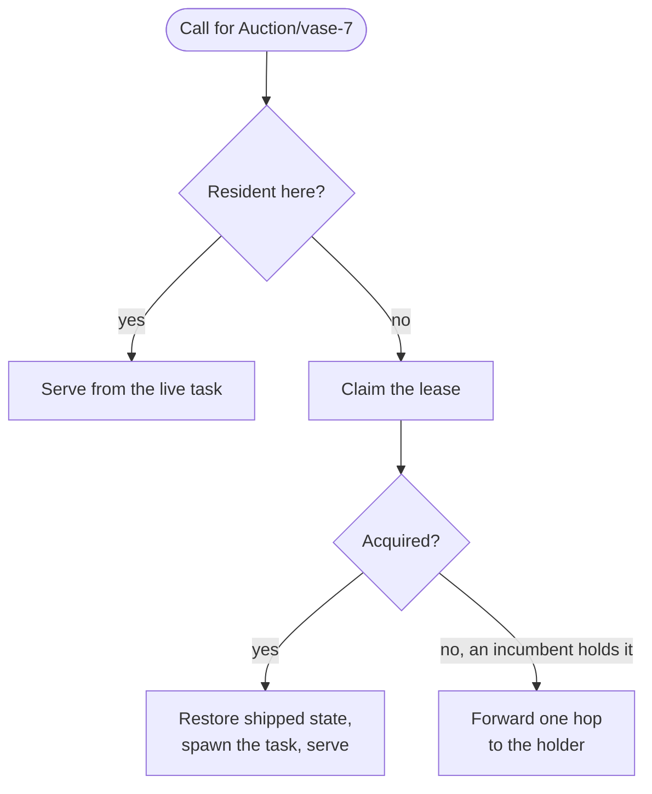
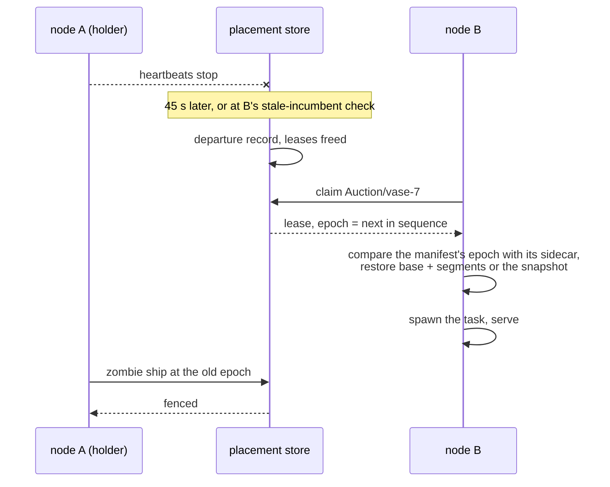
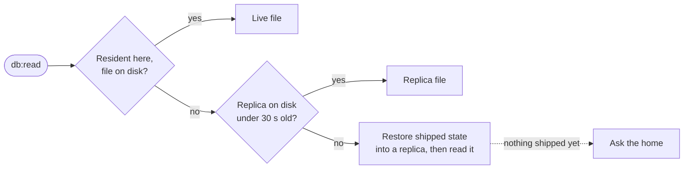

## Identity and home

An object's identity is the triple (scope, class, name). Its
platform-wide id is the blake3 hash of that triple; the scope is the
project for resource classes and the script for cron schedules.

An object lives on exactly one node at a time: the **lease holder**.
The first call to a non-resident object claims the lease for the node
the call landed on, so objects home where their traffic arrives.

## Leases and epochs

<table>
  <thead>
    <tr><th>Rule</th><th>Number</th></tr>
  </thead>
  <tbody>
    <tr><td>a lease lives exactly as long as its holder stays in the node registry; there is no per-lease clock</td><td>a node ages out after 45 s without a heartbeat (<code>NODE_TTL_SECS</code>)</td></tr>
    <tr><td>a claim against a dead holder frees the lease and wins; recovery is the same path as first placement</td><td></td></tr>
    <tr><td>a graceful shutdown deregisters at the signal, freeing every lease at once; a crash waits for age-out, and calls forwarded to the dead node fail until then</td><td>45 s at most</td></tr>
    <tr><td>a resident object refreshes its claim on a call, throttled</td><td>once per 10 minutes</td></tr>
    <tr><td>every claim draws the object's <b>epoch</b> from one cluster-wide sequence; a delete takes the next value with its tombstone</td><td></td></tr>
  </tbody>
</table>

## Durability

Writes mark the object dirty and one background flight per object
ships to blob storage, coalescing bursts.

<table>
  <thead>
    <tr><th>What ships</th><th>When</th></tr>
  </thead>
  <tbody>
    <tr><td>the whole file</td><td>the object is under 256 KB (<code>OBJECT_SHIP_WHOLE_MAX_KB</code>)</td></tr>
    <tr><td>the write-ahead log frames since the last flight, against a base laid down at a checkpoint</td><td>larger objects; the cost follows the delta, not the database</td></tr>
    <tr><td>a fresh base</td><td>the log passes 4 MB or 64 segments (<code>OBJECT_WAL_ROTATE_KB</code>, <code>OBJECT_MAX_SEGMENTS</code>)</td></tr>
  </tbody>
</table>

The epoch fences every ship: a zombie ex-holder's upload loses to any
newer epoch. A graceful stop flushes dirty objects before the process
leaves, within a budget of 50 ms per dirty object; whatever the budget
leaves behind is covered by the fence and the next holder's restore.

A claim restores the last shipped state whenever the store's copy is
newer than the node's own file: the base plus its shipped segments
replayed by SQLite itself, or the snapshot directly. A sidecar records
the epoch of the node's last residency, so a node returning to an
object it hosted long ago cannot serve stale state.

## Database reads from anywhere

`db:read` and `db:read_one` on a [database](/docs/reference/database)
do not need the home. Every object method, and every `query`, goes to
the home. A read is answered from the nearest copy, in this order:

A **replica** is the last shipped state restored beside the node's
own data, reused for 30 seconds (`OBJECT_REPLICA_TTL_SECS`). Reads
scale with the number of nodes and trail writes by up to the ship
interval plus the TTL; writes serialize at the one home.

## Serialized calls

One task per resident object runs its calls one at a time, in arrival
order, with a mailbox of 128 waiting calls behind it. That is the
"once, serialized" promise in [guarantees](/docs/runtime/guarantees).
Between calls, the object's delivery pump runs; see
[event delivery](/docs/internals/delivery).

## Alarms

An armed alarm is mirrored to the placement store off the call's
transaction, retried three times. Every node sweeps the mirror every
30 seconds (`OBJECT_SWEEP_SECS`), 256 rows per pass, and re-mirrors
every alarm on its own disk once at boot. Waking an object is claiming
it, so an alarm whose home died fires on whichever node sweeps it
first.

Because the mirror write is asynchronous, a rolled-back arm can leave
a spurious row. The cost is one wasted wake: the object's own storage
is the truth the wake checks against.

## Related

- [The cluster](/docs/internals/topology): node membership, which
  leases hang off.
- [Objects](/docs/runtime/objects): the user-facing surface this
  machinery hosts.
- [Guarantees and limits](/docs/runtime/guarantees): failure behaviour
  as a promise.
