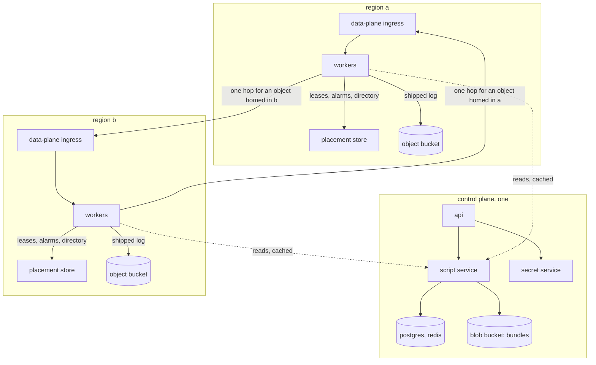

A deployment is one control plane and one or more regions. The
division of labor, the one kind of traffic that crosses a region
boundary, and the two operations that involve more than one region.

## The parts

A **region** is a placement store, an object bucket, and workers,
all carrying one region name (`REGION`). Everything that makes an
object work is inside it: leases, membership, alarms, the instance
directory, replicas, the shipped log. A node dying is the region's
own affair, handled exactly as on a single-region cluster. Placement
stores never talk to each other.

The **control plane** is shared: projects, scripts, revisions,
bundles, secrets, project policy, and the registry of regions. Every
region's workers read it, cached on the pointer ttl, the way they
read the script pointer. Bundles live in its blob bucket, immutable
and content-addressed, and workers everywhere cache them by hash.

## Where an object lives

Every project has a **home region**, recorded when it is created:
the region of the ingress that received the create request, else
the control plane's own. A class may pin its instances elsewhere by
declaration (`placement = { region = "eu-west" }`). An object is
**born** in the pin's region or, without one, the project's home.
Every caller computes that from the class and the project, which it
already holds. No service is asked where an object is.

The platform may later move an object away from its birth region.
Then the birth region's placement store keeps one **forwarding row**
for it, and a claim there answers the row's region instead of a
lease. This is the only mutable placement state in the design, and
it is written only by a move and read only for an object that moved.

## The one thing that crosses

A call that lands in a region other than the object's forwards once
to that region's data-plane ingress and answers over the same
connection. The receiving region claims locally, spawns or finds the
object, and answers. If the object was born there and has since
moved on, the reply says so and the caller forwards once more,
remembering the region for next time.

Nothing else crosses. Streams between objects in different regions
ride the same one-hop forward, asynchronously, on a path nobody
waits on. A region the control plane does not know is served where
the call landed rather than failed, so a misconfigured name is served
locally rather than failed.

## The home is a fence

A worker checks its object's current region before every flight.
When the region is not its own, because the project was moved or
failed over, the flight ships nothing and the residency ends. A
sweep also walks residents and puts to sleep any whose project is
moving or whose home is elsewhere. So a region that comes back after
an outage cannot write over what the new home has done, and a worker
still holding an object the platform moved cannot either.

## Moving a project

A project moves as a job, because its bytes live in a bucket and its
homes are leased caches:

1. **Mark.** The project is marked moving. New claims for it are
   refused everywhere with a retryable answer.
2. **Drain.** Every worker's cached policy turns moving within a
   pointer ttl, and its sweep puts the project's residents to sleep;
   their shippers settle.
3. **Copy.** The control plane lists the project's objects at the old
   region's placement store and copies each object's prefix and the
   project's directory from the old region's storage to the new,
   manifests last. It copies pass after pass from the newest time it
   saw until a pass copies nothing, so a residency still settling its
   last write is caught; then it carries any forwarding rows over.
4. **Flip.** The home changes. Caches see it within a pointer ttl;
   a call in the window is refused as moving and retried.
5. **Clear.** The mark comes off. The next touch claims in the new
   region and restores from its bucket, as any cold wake does.

Every write answered before the move is present after it. The
console follows the move on the project's policy page.

## A region becoming unreachable

The project's bytes exist in another region's bucket through the
storage's own replication, minus its lag. The operator rehomes the
project; the next touch claims and restores there. What is lost is
bounded by the lag and stated as such. The old region returning
cannot write, because the home is a fence.

## Running two regions

The repository's compose overlay adds a region `b` beside the base
stack's `a`: a second placement store on a second database, two
workers on a second bucket. The region drill registers both with the
control plane, homes a project in `a`, calls it through `b`, moves it
under writes, and checks that every acknowledged write is present
and that each side serves or forwards as it should.
