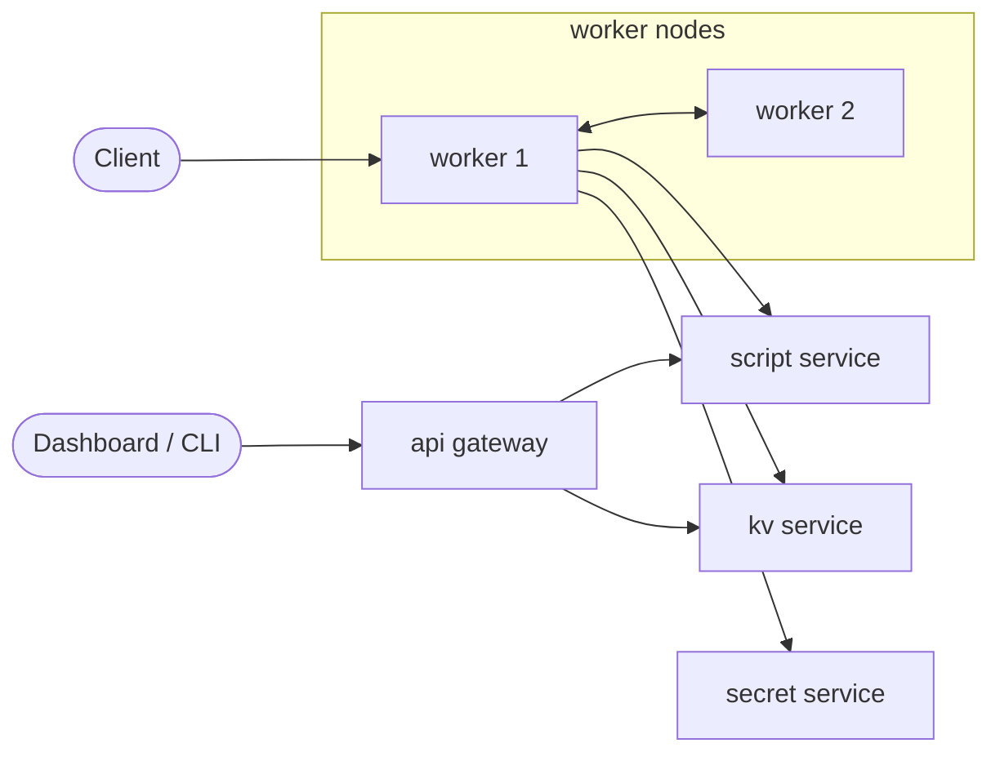
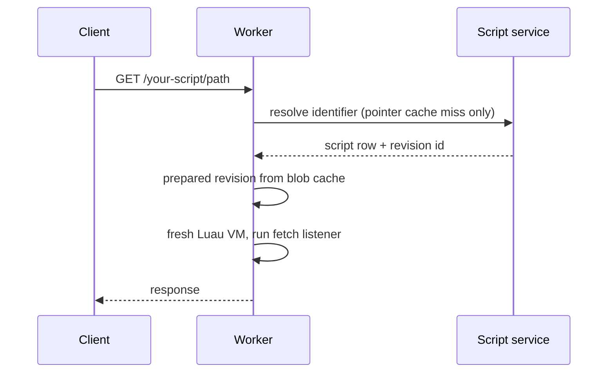

None of this is needed to build on Actias. It explains how the platform
behaves under load, for readers who want the mechanics behind the
promises in [guarantees](/docs/runtime/guarantees).

## Services

<table>
  <thead>
    <tr><th>Service</th><th>Stores</th><th>Role</th></tr>
  </thead>
  <tbody>
    <tr><td>worker</td><td>SQLite per object, local caches</td><td>runs scripts, hosts objects, serves HTTP and the node-to-node data plane</td></tr>
    <tr><td>script service</td><td>Postgres, Redis, blob storage</td><td>scripts and revisions, the placement store, live dev sessions</td></tr>
    <tr><td>kv service</td><td>Postgres by default; ScyllaDB selectable</td><td>typed key-value pairs by project and namespace</td></tr>
    <tr><td>secret service</td><td>Postgres</td><td>envelope-encrypted secrets; workers hold no key material</td></tr>
    <tr><td>api</td><td>Postgres</td><td>public REST gateway: auth, projects, access control</td></tr>
  </tbody>
</table>

Services speak gRPC to each other. Workers also speak gRPC among
themselves: forwarded object calls, delivery batches, and replica
reads all travel node to node without a coordinator.

The api is the control plane: it never sits in the path of a running
script. A worker outage and an api outage are independent failures.

## One request

Every request runs in a fresh VM. Nothing survives between requests in
the interpreter; everything durable lives behind a platform surface
(objects, kv, queues).

## Caches

<table>
  <thead>
    <tr><th>Cache</th><th>Maps</th><th>Bounded by</th><th>Staleness cost</th></tr>
  </thead>
  <tbody>
    <tr><td>pointers</td><td>public identifier to script row</td><td>time</td><td>a publish becomes visible within the TTL</td></tr>
    <tr><td>revisions</td><td>revision id to prepared program</td><td>bytes</td><td>none, revisions are immutable</td></tr>
    <tr><td>blobs</td><td>blake3 hash to bytes</td><td>bytes</td><td>none, content-addressed</td></tr>
  </tbody>
</table>

The caches make the steady state node-local: the script service is
consulted on cache misses, not per request. A worker that has served a
script once keeps serving it through a control-plane outage until the
pointer expires.

## Node membership

Every worker registers with the placement store at boot and proves
liveness by heartbeat. Each beat carries the node's in-flight request
count. Missing several beats in a row ages the node out.

Membership is the root fact of the cluster: object leases and alarm
rows hang off it. A graceful shutdown deregisters immediately, freeing
everything the node held; a crash waits for age-out.

## Related

- [Object placement](/docs/internals/placement): leases, homes, and
  what membership changes do to them.
- [Event delivery](/docs/internals/delivery): the node-to-node fan-out
  path.
- [Guarantees and limits](/docs/runtime/guarantees): the promises this
  machinery upholds.
