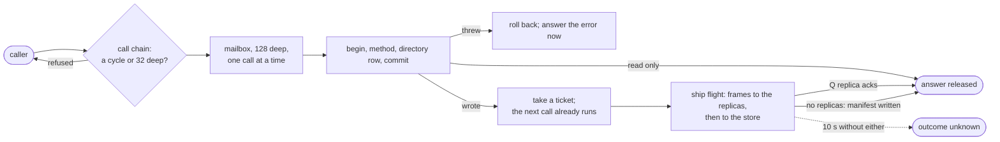

## Delivery

<table>
  <thead>
    <tr><th>Surface</th><th>Promise</th><th>What your code must do</th></tr>
  </thead>
  <tbody>
    <tr><td>Object method call</td><td>a call the platform answered ran exactly once, serialized per object</td><td>a call that failed with an unknown outcome may have run; retry it the way any timed-out request is retried</td></tr>
    <tr><td>Queue message</td><td>at-least-once</td><td>handler safe to run twice</td></tr>
    <tr><td>Object stream edge</td><td>at-least-once, in order per publisher; a handler that committed never re-runs for the same event</td><td>effects outside the follower's own transaction safe to run twice</td></tr>
    <tr><td>Connection edge</td><td>at-most-once</td><td>client re-reads state on reconnect</td></tr>
    <tr><td>Workflow step</td><td>recorded once, replayed after</td><td>keep run code deterministic</td></tr>
    <tr><td>Alarm</td><td>fires once per set, survives restarts; its handler's writes are not gated, so a crash mid-handler loses them without a re-fire</td><td>an alarm handler's work that must not be lost re-arms itself</td></tr>
    <tr><td>Directory row</td><td>every object that matched is present; a row may briefly still match after the object changed</td><td>plan for over-inclusion, never for omission</td></tr>
  </tbody>
</table>

At-least-once means a repeat is possible after a machine failure at
the wrong moment. Make repeated work harmless: check an id, use
`INSERT OR IGNORE`, or update conditionally on current state.

Stream edges narrow the window: the follower records the event in the
same transaction as its handler's writes, so a redelivered event is
skipped, not re-run. Effects that leave that transaction are the part
to keep idempotent.

At-most-once means loss is possible. Only connection edges promise
this, because a tab can vanish mid-frame. Anything that must survive
belongs on the object one hop back.

## Ordering

Events from one publisher reach one follower in publish order. There
is no ordering promise across different publishers. If order matters
across sources, put a sequence number in the data.

Calls to one object are ordered. Calls to different objects are not.

## Transactions

A method's writes to `state.sql` commit together when the method
returns. A `state:publish` inside the method is part of the same
commit, so an event never describes a write that did not happen. The
directory row, if the class declares one, is derived inside the same
transaction.

The answer waits for one thing more than the commit: the writes
leaving the machine. Calls that arrive while an answer is waiting
still run, so a busy object commits at its own speed and a burst of
writes leaves together. A request that makes several calls to objects
on its own node gets each answer at commit and waits once, before its
response and before any outbound request, for all of them.

Migrations apply inside the transaction of the call that triggered
them: a failing migration applies nothing and surfaces as that call's
error.

Workflow steps commit their journal entry with their result. A crash
between two steps replays from the last recorded one.

## Limits

Defaults, all operator-tunable on a self-hosted worker.

<table>
  <thead>
    <tr><th>Limit</th><th>Value</th><th>What happens at it</th></tr>
  </thead>
  <tbody>
    <tr><td>Guest work budget</td><td>5,000,000 work units (<code>GUEST_WORK_LIMIT</code>), about a second of solid computation, per request, object call and connection item</td><td>the run is cut off</td></tr>
    <tr><td>Wall backstop</td><td>10 seconds (<code>GUEST_WALL_SECS</code>), for code stuck outside the vm</td><td>the run is cut off</td></tr>
    <tr><td>Request deadline</td><td>30 seconds, waiting included</td><td>the request fails</td></tr>
    <tr><td>Request body</td><td>10 MB</td><td>413</td></tr>
    <tr><td>Object database</td><td>1 GB per instance (<code>OBJECT_DB_MAX_MB</code>)</td><td>writes fail, reads keep working</td></tr>
    <tr><td>Object mailbox</td><td>128 waiting calls</td><td>callers wait; nothing is dropped</td></tr>
    <tr><td>Object call chain</td><td>32 deep; an object calling itself, directly or through others, is a cycle</td><td>refused, naming the cycle or the depth</td></tr>
    <tr><td>Writes from one request</td><td>answered at commit; the response waits once for all of them; a later <code>read</code> of the same object in that request sees them</td><td>a write that cannot be confirmed makes the whole response fail with an unknown outcome</td></tr>
    <tr><td>Database <code>read</code> anywhere</td><td>sees every write answered before it began, whichever node serves it</td><td>nothing</td></tr>
    <tr><td>Durability gate</td><td>10 seconds for a write to reach a quorum of its replicas, or the store</td><td>the call fails with an unknown outcome; the write keeps trying to ship</td></tr>
    <tr><td>Object idle</td><td>300 seconds without a call, delivery or alarm</td><td>the instance goes cold; the next call wakes it</td></tr>
    <tr><td><code>state.store</code> value</td><td>65,536 bytes as stored text</td><td>refused, naming the key</td></tr>
    <tr><td>kv value</td><td>no fixed limit</td><td></td></tr>
    <tr><td>Replica read wait</td><td>50 ms for a node's copy to reach what the owner answered</td><td>the read goes to the owner instead</td></tr>
    <tr><td>Queue attempts</td><td>5, first retry 2s, doubling to 1h</td><td>dead-lettered</td></tr>
    <tr><td>Queue file</td><td>64 MB</td><td><code>send</code> raises</td></tr>
    <tr><td>Stream edge attempts</td><td>8, first retry 500ms, doubling to 32s</td><td>the edge is dropped</td></tr>
    <tr><td>Stream delivery</td><td>10 seconds per attempt</td><td>counts as a failed attempt</td></tr>
    <tr><td>Connection inbox</td><td>256 items</td><td>deliveries: the edges are severed; client frames: the wire closes</td></tr>
    <tr><td><code>conn.state</code></td><td>64 KB serialized</td><td>the handler raises and the connection ends; a bigger session belongs in an object</td></tr>
    <tr><td>Connection idle</td><td>300 seconds</td><td>the vm hibernates; the socket stays open</td></tr>
    <tr><td>Directory row</td><td>4 KB encoded, 5 ms to derive</td><td>the derivation fails; the last good row stands</td></tr>
  </tbody>
</table>

Guest code is metered in work rather than seconds, so waiting on io,
a database or another object costs nothing and only computation counts.
The clock stays as a backstop for what the meter cannot see.

The connection inbox is not a buffer to fill. A connection whose
handlers cannot keep up has chosen to fall behind, and the platform
severs its edges rather than growing memory on its behalf.

An idle connection hibernates: its vm drops after 300 seconds and
rebuilds for the next item its program declares a handler for, with
`conn.state` intact. A class that declared `event = "forward"` does
not rebuild it for deliveries at all. A connection with a timer stays
warm.

## Failure behaviour

A hard crash cannot take back a call the platform answered. A method
that wrote is not answered until its writes have reached durable
storage off the machine: a quorum of the object's replica nodes, or
the blob store when there are none. Anything you were told succeeded
survives the loss of the node that ran it, and the next node to hold
the object takes it over from a replica without touching the store.

<table>
  <thead>
    <tr><th>Event</th><th>What survives</th><th>What does not</th></tr>
  </thead>
  <tbody>
    <tr><td>a machine leaves gracefully (deploys, scale-downs)</td><td>everything: the drain ships every dirty object it can within 50 ms each, and the epoch fence plus the next holder's restore cover the rest</td><td>nothing</td></tr>
    <tr><td>a machine crashes</td><td>every answered call; alarms re-arm from storage, runs resume from their journal, queue messages redeliver, subscriptions follow their follower's rehoming</td><td>calls still waiting for an answer (the caller sees an unknown outcome) and platform work with no caller, such as an alarm handler's writes</td></tr>
    <tr><td>durable storage is unreachable</td><td>reads keep answering</td><td>writes stop being acknowledged: the call fails with an unknown outcome after ten seconds while the platform keeps trying to store it, so a retry needs the same idempotence any timed-out request needs</td></tr>
    <tr><td>a node goes away</td><td>objects, runs, queues</td><td>connections: clients reconnect and re-follow, which happens often enough (deploys, scaling) to be part of the client from the start</td></tr>
  </tbody>
</table>
