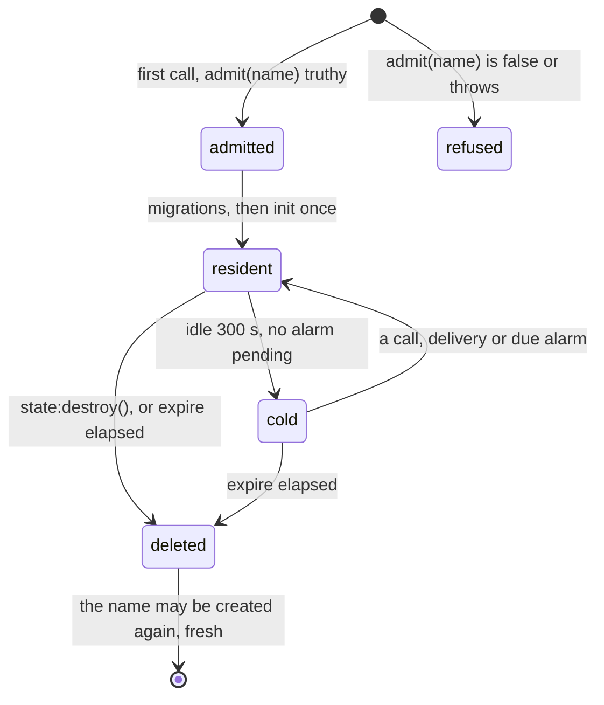

## Declare a class

```lua
local Auction = object "Auction" {
    migrations = "migrations/Auction",

    bid = function(state, user, amount)
        local high = state.sql:query_one(
            "SELECT amount FROM bids ORDER BY amount DESC LIMIT 1")
        if high and amount <= high.amount then
            return { ok = false, refusal = "does not beat " .. high.amount }
        end
        state.sql:exec("INSERT INTO bids (at, user, amount) VALUES (?, ?, ?)",
            { state.now(), user, amount })
        return { ok = true, high = amount }
    end,
}
```

Call an instance by name:

```lua
local result = Auction("lot-42"):bid("ada", 25)
```

## One call at a time

An object handles one call at a time. Two bids arriving together
cannot interleave the read and the write above, so exactly one wins.
No lock, transaction or retry loop.

Serialization applies per instance. `Auction("lot-42")` and
`Auction("lot-43")` run in parallel with separate storage.

An object may call other objects from a method. A chain that returns
to an object already in it would wait on itself, so it is refused
rather than deadlocked, as is a chain 32 calls deep. Up to 128 calls
wait in an instance's mailbox; past that, callers wait for room.

## Lazy instances

An instance costs nothing until something calls it. There is no create
step, and a name nobody calls does not exist.

Arguments and return values must be JSON-representable, since a call
can cross machines.

## state

<table>
  <thead>
    <tr><th>Field</th><th>What it is</th></tr>
  </thead>
  <tbody>
    <tr><td><code>state.sql</code></td><td>this instance's private database</td></tr>
    <tr><td><code>state.store</code></td><td>key-value face on the same storage</td></tr>
    <tr><td><code>state.name</code></td><td>the instance name</td></tr>
    <tr><td><code>state.now()</code></td><td>platform clock, milliseconds</td></tr>
    <tr><td><code>state:set_alarm(duration)</code></td><td>schedule the <code>alarm</code> hook</td></tr>
    <tr><td><code>state:other_method(...)</code></td><td>a sibling method of the same class, run directly inside this call</td></tr>
    <tr><td>any other key</td><td>scratch: in memory, gone when the object sleeps</td></tr>
  </tbody>
</table>

Streams add more verbs to `state`; see [Streams](/docs/runtime/streams).

In a `--!strict` file, annotate each method's state the way a typed
React component declares its props: `state: ObjectState` for the
platform's fields alone, or name your own type on top of it to also
cover scratch keys and sibling methods. A bare `function(state)` stays
untyped in strict mode and the checker will say so. The worked pattern
lives in `definitions/objects.d.luau`, which ships with every project.

## Small state

A counter, a phase, a timestamp: state that small does not deserve a
migrations directory. `state.store` holds it with nothing declared:

```lua
local Counter = object "Counter" {
    hit = function(state)
        local n = (state.store:get("count") or 0) + 1
        state.store:set("count", n)
        return n
    end,
}
```

It takes [kv](/docs/reference/kv)'s verbs (`get`, `set`, `delete`,
`set_batch`, `list`) over the object's own storage, so a call that
touches both faces commits once. Values cap at 64 KB each; state past
that, or state worth querying, wants a table in `state.sql`. The
[object reference](/docs/reference/objects) has the exact shapes.

## Schema

```lua
local Auction = object "Auction" {
    migrations = "migrations/Auction",
    hooks = {
        init = function(state)
            state.sql:exec("INSERT INTO meta VALUES ('state', 'open')")
        end,
    },
}
```

<table>
  <thead>
    <tr><th>Form</th><th>Schema</th><th><code>init</code> is for</th></tr>
  </thead>
  <tbody>
    <tr><td>with <code>migrations</code></td><td>the <code>.sql</code> files, applied before the first call</td><td>seeding rows</td></tr>
    <tr><td>without</td><td>whatever <code>init</code> creates</td><td>creating tables</td></tr>
  </tbody>
</table>

`init` runs once per instance, ever. It does not run again on restart
or after a deploy, so an instance created before a schema change keeps
its old tables unless migrations move it forward.

## Alarms

```lua
local Auction = object "Auction" {
    open = function(state, duration_ms)
        state:set_alarm(tostring(duration_ms) .. "ms")
    end,

    hooks = {
        alarm = function(state)
            state.sql:exec("INSERT OR REPLACE INTO meta VALUES ('state', 'closed')")
        end,
    },
}
```

Durations are written `"500ms"`, `"30s"`, `"10m"`, `"24h"`, `"7d"`;
`set_alarm` also takes a bare number of seconds.

One alarm per object; setting another replaces it. It fires with no
browser open and no request arriving, and it survives restarts:
whichever machine holds the object next re-arms it from storage.

Use alarms for deadlines an entity owns. Do not sweep a table looking
for overdue rows.

## Finding instances

A class can declare a `directory`: one row per object, derived from
its own state, queryable with `Auction:list`, `Auction:find` and
`Auction:visit` without waking anything. See
[Directory](/docs/runtime/directory).

## Lifecycle



An instance exists from its first call until something ends it, and
three declarations shape that span:

```lua
local Session = object "Session" {
    expire = "30d",
    admit = function(name)
        return #name > 3
    end,

    close = function(state)
        state:destroy()
    end,
}
```

- **`expire`** declares a lifespan measured in idleness: an instance
  untouched for that long is deleted by the platform. A call renews
  the clock, at most once every ten minutes, and a pending alarm
  postpones the sweep, so a busy or scheduled object never expires
  under you.
- **`admit`** gates creation, not access: it runs once when a name
  would first come to exist, with only the name, before any storage
  does. A refused name leaves nothing behind. The refusal is
  remembered for a while, so an immediate retry is refused too.
- **`state:destroy()`** ends the instance from inside a method. The
  current call still returns its value; then storage, snapshot and
  edges are reclaimed. Calls arriving afterwards refuse with
  `The object was destroyed.` while the deletion finishes.

Deletion is forget, never a ban: a deleted or expired name may be
created again later and starts completely fresh. There is no undo.
The console's object header shows a lifespanned instance's deadline
and offers the same deletion.

## Placement

The platform decides which machine hosts each object and moves it when
a machine goes away. Calls to the same object always reach the same
one; a call to a sleeping object wakes it first.

<table>
  <thead>
    <tr><th>State</th><th>Means</th><th>Costs</th></tr>
  </thead>
  <tbody>
    <tr><td><b>Resident</b></td><td>the instance lives on a node right now; calls reach it in memory and the node holds its lease</td><td>a task and an open file</td></tr>
    <tr><td><b>Cold</b></td><td>only its storage exists; the next call, delivery or due alarm wakes it on whichever node the platform picks</td><td>nothing</td></tr>
  </tbody>
</table>

Cold is the normal state, not a degraded one: sleeping objects are
files, so millions of idle instances are fine. Waking is transparent
to callers beyond the wake itself. The console's object header names
which state an instance is in.

### Gotchas

- A single very busy object is a bottleneck, because it runs one call
  at a time. Use more objects (one per lot, room, user) rather than a
  bigger one.
- Scratch keys on `state` look durable and are not. Anything you need
  after the object sleeps goes in `state.store` or `state.sql`.
- `Auction("lot-42"):bid()` from inside a method of `Auction("lot-42")`
  is a cycle and is refused. Call the sibling as `state:bid()` instead.

## Related

- [Streams](/docs/runtime/streams): how objects publish to each other.
- [Directory](/docs/runtime/directory): querying a class by declared
  fields.
- [Sharing across scripts](/docs/runtime/sharing): `objects "Auction"`
  from a sibling script reaches the same instances.
- [object reference](/docs/reference/objects): every key and verb.
