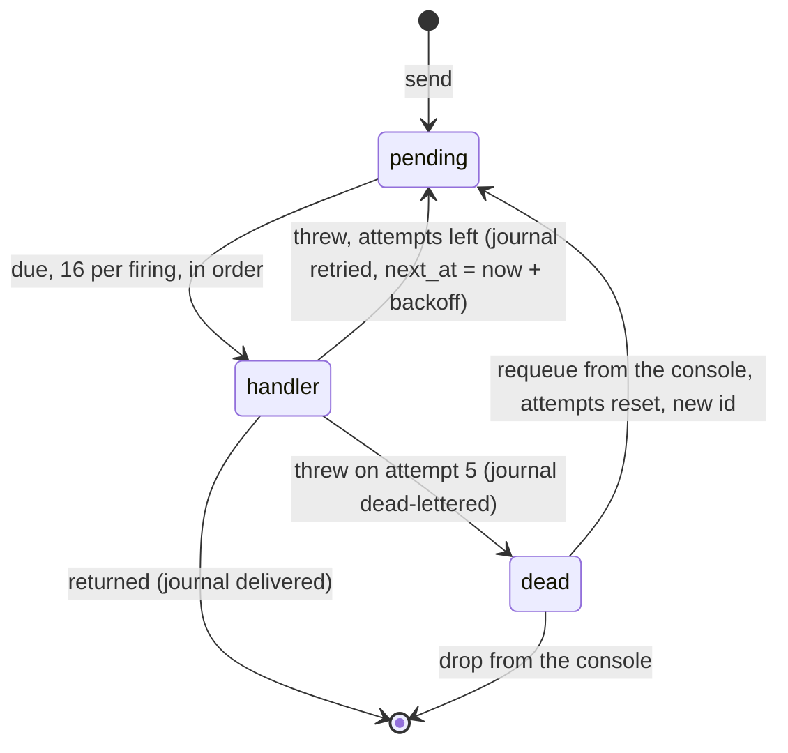

## What a queue is

A queue is a durable message list with a handler. Sending returns
immediately. The platform delivers, retries with backoff when the
handler throws, and dead-letters the message after enough failures.

```lua
local mailroom = queue "mailroom"

on "queue:mailroom" (function(job)
    if job.kind == "welcome" then
        http.make_request({
            uri = "https://email.example.com/send",
            method = "POST",
            body = json.stringify({ to = job.email }),
        })
    end
end)

on "fetch" (function(request)
    mailroom:send({ kind = "welcome", email = "ada@example.com" })
    return { status_code = 202, body = "queued" }
end)
```

The handler is declared with `on "queue:<name>"` matching the queue's
name. `actias check` refuses a queue nothing handles, and a handler
for a queue nothing declares.

## Delivery



**At-least-once delivery.** A handler that throws gets the message
again after a delay, then a longer one. Make a second run harmless:
check an id, or write `INSERT OR IGNORE` and `UPDATE ... WHERE state = 'pending'`.

**One message, one handler run.** Queues distribute work, they do not
broadcast. A queue drains on one node, in order, one message at a
time; a thousand messages are a thousand handler runs, never more.

**Bounded retries.** A message gets 5 attempts by default. The first
retry waits 2 seconds and each further one doubles, capped at an hour.

<table>
  <thead>
    <tr><th>Attempt</th><th>Runs after</th></tr>
  </thead>
  <tbody>
    <tr><td>1</td><td>immediately</td></tr>
    <tr><td>2</td><td>2s</td></tr>
    <tr><td>3</td><td>4s</td></tr>
    <tr><td>4</td><td>8s</td></tr>
    <tr><td>5</td><td>16s</td></tr>
  </tbody>
</table>

After the last one the message moves to the dead-letter list. It stops
retrying, does not block the queue, and stays there until you look at
it. Operators tune the two numbers with `QUEUE_MAX_ATTEMPTS` and
`QUEUE_BACKOFF_BASE_MS`.

## What belongs in a queue

Email, push notifications, webhooks, thumbnail fetches, anything where
a minute of delay is acceptable and the request path should not wait.

## What does not

**Addressed work.** "Tell this account it was outbid" is a call to
that object, not a queue message. Queues are for work no specific
entity owns.

**Multi-step processes.** If the job waits on a human or has stages,
use a [workflow](/docs/runtime/workflows). Queue messages are
anonymous, so a queue cannot answer "how is that one doing".

## Inspecting

The console shows the depth, the messages due now, the delivery
journal (the last 300 entries, payloads kept to 32 KB), the dead
letters, and requeue and drop actions. A requeued message starts its
attempts over under a new id.

### Gotchas

- A handler that throws is a retry, not a failure you see at the call
  site. `send` returned long before the handler ran.
- Retries are per message. A poison message does not stall the ones
  behind it; it dead-letters and the queue keeps draining.
- The handler name must match the queue name exactly.
  `on "queue:mailroom"` serves `queue "mailroom"` and nothing else.
- One script per project handles a given queue. Any script in the
  project may send to it.

## Related

- [Workflows](/docs/runtime/workflows): staged jobs you can ask about.
- [Sharing across scripts](/docs/runtime/sharing): any script in the
  project may send; the handler's script drains.
- [queue reference](/docs/reference/queue): every method.
