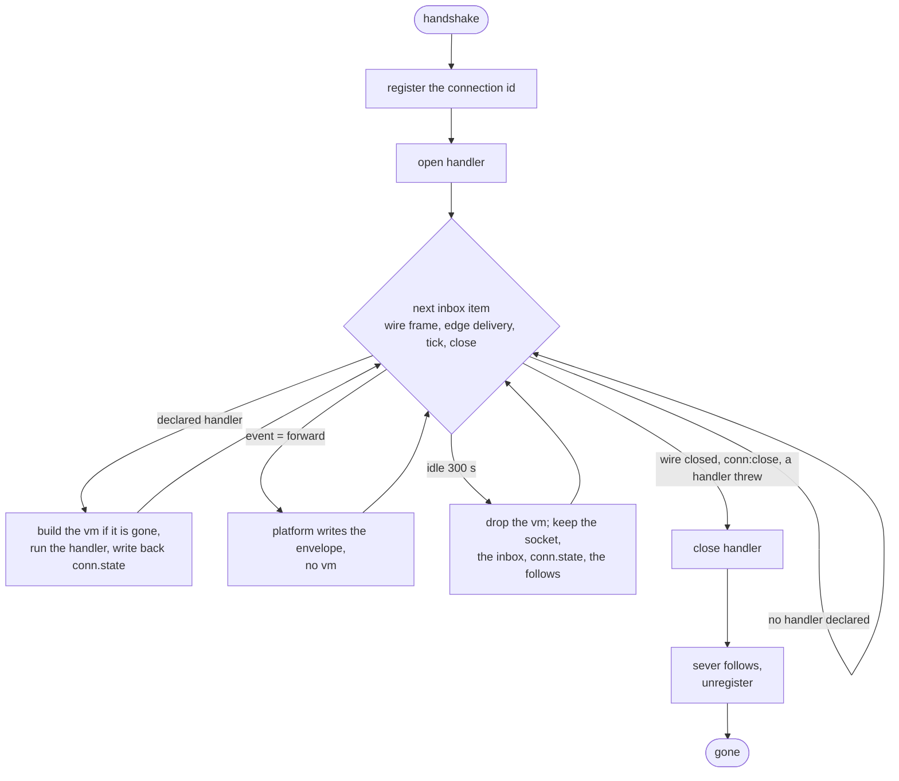

## Declaring a connection

A connection's program is a top-level declaration, the same shape as
an object class: named handlers for the wire's stimuli.

```lua
local Room = objects "Room"

local Session = connection "Session" {
    -- Runs once per connection, before any item. conn.state was
    -- seeded by the upgrade call.
    open = function(conn)
        conn:follow(Room(conn.state.room), "message")
    end,

    -- A json frame the client sent up the wire.
    frame = function(conn, data)
        Room(conn.state.room):post(conn.name, data.text)
    end,

    -- A delivered edge event. A function chooses a custom wire shape;
    -- event = "forward" sends the platform envelope instead, without
    -- running any code at all.
    event = function(conn, event)
        conn:send({ event = "message", text = event.data.text })
    end,

    -- A heartbeat on the connection's own clock.
    timer = { every = "30s", run = function(conn, missed)
        conn:send({ event = "ping" })
    end },

    -- The wire ended, either side. Edges are severed by the platform
    -- after this returns; cleanup here is app-level courtesy.
    close = function(conn) end,
}
```

Nothing calls a connection, so a body declares handlers, not methods.
A key outside `open`, `frame`, `event`, `timer` and `close` refuses at
declaration, and `actias check` verifies the shapes.

## Upgrading

A websocket handshake arrives as an HTTP request, so it authenticates
in the same router as everything else.

```lua
local User = objects "User"

on "fetch" (function(request)
    if request.upgrade and request.path == "/ws" then
        local name = request.query.user
        if name == nil then
            return { status_code = 401, body = "log in first" }
        end

        return request:upgrade(Session, { room = "lobby" }, User(name))
    end

    return { status_code = 404, body = "" }
end)
```

`request.upgrade` is present only when the request is a real
handshake. `request:upgrade(Class, seed?, identity)` names the
declared connection class, optionally seeds `conn.state`, and fixes
the identity the connection speaks as. Whatever the handler computed
travels only through the seed.

## conn.state

A json-serializable table, alive exactly as long as the connection:
seeded at upgrade, visible to every handler, written back after each
one returns. The seed and every later write cap at 64 KB serialized;
past it the handler raises and the connection ends.

It is not durable storage. A connection dying with its node loses it,
and the client's reconnect path re-reads real state from objects.

## Identity

The identity argument is an object handle: `User(name)`,
`Account(name)`. The connection speaks as that identity, and a
[stream gate](/docs/runtime/streams) sees it shaped like any follower.

Mint it after authenticating. It is fixed for the life of the
connection and cannot be changed by anything the client sends.

## Sending and receiving frames

`conn:send(value)` writes one JSON text frame. The wire carries JSON
text only: a binary frame, or text that does not parse as JSON, is
dropped without reaching `frame`.

Apart from the envelope a class asks for with `event = "forward"`,
there is no platform wire protocol: the frames on the wire are the
ones your handlers send. To let clients change subscriptions, define a
frame for it:

```lua
frame = function(conn, data)
    if data.op == "watch" then
        if conn.state.watching then
            conn:unfollow(Auction(conn.state.watching), "bid")
        end
        conn.state.watching = data.id
        conn:follow(Auction(data.id), "bid")
    end
end,
```

## Timers

`timer = { every = "30s", run = function(conn, missed) end }` runs on
the connection's own clock, one second or longer. `missed` counts
ticks that fell during a previous run; the next deadline realigns to
the grid rather than drifting. A tick never queues behind the inbox,
so a heartbeat cannot overflow it. A connection with a timer never
hibernates.

## Connection edges

`conn:follow` makes an edge like `state:follow` does, with different
promises:

<table>
  <thead>
    <tr><th></th><th>object edge</th><th>connection edge</th></tr>
  </thead>
  <tbody>
    <tr><td>delivery</td><td>at-least-once</td><td>at-most-once</td></tr>
    <tr><td>retry</td><td>yes, with backoff</td><td>none</td></tr>
    <tr><td>on failure</td><td>retried, then dropped</td><td>edge removed</td></tr>
    <tr><td>lifetime</td><td>until unfollowed</td><td>dies with the connection</td></tr>
  </tbody>
</table>

A tab that closes takes its edges with it. Nothing accumulates for
dead connections. Put durability one hop back: the account object
follows what must not be missed; the connection follows the account
for live updates.

## Warm, hibernated, gone



<table>
  <thead>
    <tr><th>State</th><th>Holds</th><th>Cost</th><th>Leaves it</th></tr>
  </thead>
  <tbody>
    <tr><td>warm</td><td>a vm and everything below</td><td>a vm</td><td>300 s idle drops the vm (<code>CONNECTION_HIBERNATE_SECS</code>; 0 disables)</td></tr>
    <tr><td>hibernated</td><td>the socket, the inbox, <code>conn.state</code>, the follows</td><td>about a file descriptor</td><td>anything with a declared handler to run rebuilds the vm</td></tr>
    <tr><td>gone</td><td>nothing</td><td>zero</td><td>is the end</td></tr>
  </tbody>
</table>

Hibernation is invisible from both ends of the wire: the socket stays
open, deliveries land in the inbox, and `conn.state` is exactly what
the last handler left. It is a memory economy, not durability.

An undeclared handler costs nothing at all: a close with no `close`
handler never builds a vm to discover there is nothing to run. Neither
does a delivery to a class that declared `event = "forward"`, since
the platform writes that frame itself.

## Backpressure and limits

Handlers for one connection run one at a time, in arrival order, each
as one platform call under the call budget. Each connection has an
inbox of 256 items.

<table>
  <thead>
    <tr><th>Inbox full because of</th><th>What happens</th></tr>
  </thead>
  <tbody>
    <tr><td>edge deliveries the handlers cannot keep up with</td><td>the delivery is refused and every edge the connection holds is severed; the socket stays open, silent</td></tr>
    <tr><td>client frames arriving faster than the handlers run</td><td>the wire is closed</td></tr>
  </tbody>
</table>

A handler throwing, `conn:close()`, or the peer disconnecting all end
the connection and remove the edges it made.

## Wires this project opened

A connection is a wire with a program attached, and which side opened
the wire does not change that. `Class:open(url, seed?, options?)`
dials a `ws://` or `wss://` url through the egress policy and runs the
same handlers over it: `open` once the handshake is up, `frame` per
message from the far side, `event` for what it follows, `close` when
it ends. It hibernates and holds `conn.state` like any other
connection, lives on the node that opened it, and shows up in the
console's Connections page marked outbound.

```lua
local Upstream = connection "Upstream" {
    open = function(conn)
        conn:follow(Chat(conn.state.room), "upstream")
        Chat(conn.state.room):wire_up()
    end,
    event = function(conn, event) conn:send(event.data) end,
    frame = function(conn, data) Chat(conn.state.room):token(data) end,
    close = function(conn) Chat(conn.state.room):upstream_closed(conn.closed) end,
}
```

Three rules make it easy to hold right.

**The wire says when it is up.** `open` returns when the handshake is
up, not when the wire's `open` handler has followed anything, and that
handler's follow lands only after the call that opened the wire
returns. So the handler follows and then posts into the object, and
the object sends what was waiting from there; a publish in the same
call that opened the wire reaches nobody.

**Sending up the wire is publishing.** The connection has no socket
handle in Lua. Whoever wants to send publishes on a topic the
connection follows, and the `event` handler sends the payload raw.
The publisher's code is the same whether the wire is up, reopening or
gone, and a topic meant for the wire alone is guarded by the object's
`follow` hook admitting only that class:

```lua
publishes = { tokens = "public", "upstream" },
hooks = {
    follow = function(state, topic, follower)
        return topic == "tokens" or follower:is(Upstream)
    end,
},
```

**An object owns the intent.** An inbound connection is unique because
the client's wire is; an outbound one has nobody to make it unique,
so three requests calling `open` open three wires. The thing that
decides exactly one should exist, and reopens it when it drops, is a
leased single-home job: an object. It stores the name `open`
returned, opens one only when nothing is stored, and cannot race
itself because it takes one call at a time.

Knowing a wire dropped, in order of trust:

1. The `close` handler runs on every end except a node death, with
   `conn.closed.by` saying who ended it: `peer`, `program`, `error`
   or `overflow`, and `reason` when there is one. Post into the
   owning object from it.
2. The next send: a publish into a topic the gone wire followed
   reaches nobody, and the object's next call finds no stored name
   and opens again.
3. A node death runs no handler at all. The object's stored "work
   pending" fact, its `init` and an alarm reopen the wire wherever
   the object wakes next, which is why the intent lives in the object
   and not in the connection.

A wire dropping mid-answer loses the rest of that answer. What the
`frame` handler already posted into the object is durable, since each
post is an ordinary write; the object discards its draft, tells its
followers to expect a retry, and resends. Whether the far side can
continue a partial answer is the far side's feature.

### Gotchas

- Follow targets are handles named in your code, never strings taken
  from the wire. A client sends `{op = "watch", id = "lot-42"}` and
  your code decides that means `Auction("lot-42")`.
- A dropped frame is not reported. At-most-once means the client can
  miss one and never learn that it did, which is why reconnect should
  re-read state rather than resume.
- A connection whose edges were severed for overflow learns nothing
  either. A client that stops receiving should reconnect.
- The identity is fixed at upgrade. Nothing the client sends later can
  change what the connection speaks as.
- Locals captured in the fetch handler do not reach the handlers;
  anything a session needs travels through the seed into `conn.state`.
- An outbound wire is not replayed. The platform tells you it ended
  and lets the retry be one method call; frames sent between the drop
  and the reopen are gone, as for any client that disconnected.

## Related

- [Streams](/docs/runtime/streams): the publisher side and who may
  follow.
- [connection reference](/docs/reference/sockets): every handler and
  verb.
