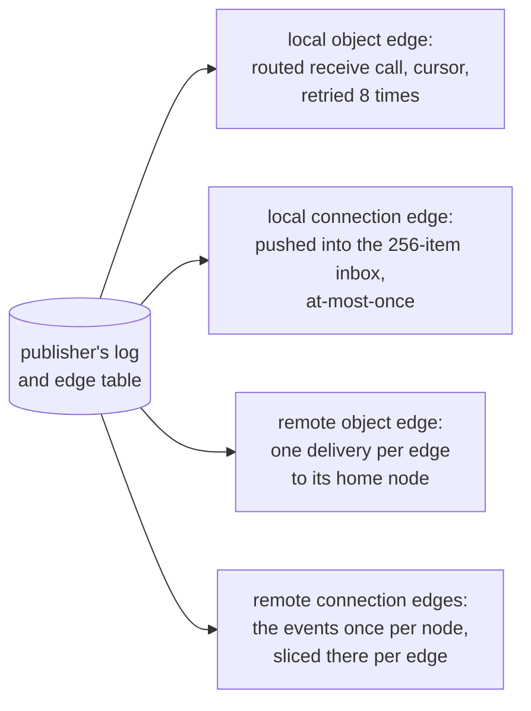

## Publishing

An object declares its topics and publishes events on them.

```lua
local Auction = object "Auction" {
    migrations = "migrations/Auction",
    publishes = { "bid", "closed" },

    bid = function(state, user, amount)
        state.sql:exec("INSERT INTO bids VALUES (?, ?, ?)",
            { state.now(), user, amount })
        state:publish("bid", { user = user, amount = amount })
    end,
}
```

`state:publish` appends the event to this object's log in the same
transaction as the write above it. An event therefore never describes a
write that did not happen.

Delivery runs after the call commits, along whatever edges exist.
Publishing an undeclared topic is an error.



## Who may follow

An edge exists only if the publisher accepted it.

```lua
publishes = {
    "bid",                  -- the follow hook decides
    events = "self",        -- only this instance's own identity
    closed = "public",      -- any identity
}
```

<table>
  <thead>
    <tr><th>Spelling</th><th>Who gets in</th></tr>
  </thead>
  <tbody>
    <tr><td>bare name</td><td>whoever the <code>follow</code> hook returns true for</td></tr>
    <tr><td><code>= "self"</code></td><td>only an identity equal to this instance</td></tr>
    <tr><td><code>= "public"</code></td><td>any identity</td></tr>
    <tr><td>neither</td><td>nobody. A missing hook fails closed</td></tr>
  </tbody>
</table>

Use the hook when the answer depends on state:

```lua
local Guild = object "Guild" {
    migrations = "migrations/Guild",
    publishes = { "activity" },
    hooks = {
        follow = function(state, topic, follower)
            return follower:is(Account) and state.sql:query_one(
                "SELECT 1 FROM members WHERE user = ?", { follower.name }) ~= nil
        end,
    },
}
```

The follower argument is data, not a live handle: `follower.name`,
`follower.id`, `follower.transport` (`"object"` or `"connection"`),
and `follower:is(SomeClass)` for its class.

### When to use "self"

`"self"` is the personal stream: a user's own notifications, reaching
whichever of their devices is connected. A websocket's identity is
minted server-side after authentication, so a connection following
`Account("ada"):events` genuinely is `Account/ada`; anyone speaking as
someone else is refused.

## Following and receiving

```lua
local Account = object "Account" {
    migrations = "migrations/Account",
    receives = {
        ["Auction:closed"] = function(state, event)
            state.sql:exec("INSERT INTO notifications VALUES (?, ?)",
                { state.now(), json.stringify(event.data) })
        end,
    },

    watch = function(state, auction_id)
        state:follow(Auction(auction_id), "closed")
    end,
}
```

`receives` keys are `"Class:topic"`. `publishes` and `receives` at the
top of a class show both directions of its data flow.

<table>
  <thead>
    <tr><th>Verb</th><th>Does</th></tr>
  </thead>
  <tbody>
    <tr><td><code>state:follow(handle, topic, filter?)</code></td><td>creates the edge; returns nothing, and raises <code>follow refused</code> when the publisher declines</td></tr>
    <tr><td><code>state:unfollow(handle, topic)</code></td><td>removes it</td></tr>
    <tr><td><code>state:drop_followers(Account(name))</code></td><td>removes every edge that identity holds</td></tr>
    <tr><td><code>state:followers(topic?)</code></td><td>lists current followers, every topic when none is named; rows carry <code>name</code>, <code>id</code>, <code>topic</code> and <code>transport</code></td></tr>
  </tbody>
</table>

The optional filter matches equality against top-level fields of the
event data, so one filtered edge replaces many topic-specific ones.

## Delivery to objects

Events reach a sleeping object. The publisher's log keeps them, the
edge tracks how far the follower has read, and delivery wakes the
follower. An account with nothing running receives every event for
what it follows, in order.

A new edge starts at the log's head: history is the publisher's state,
reached by an ordinary method, never replayed down a fresh edge.
Re-following an existing edge keeps its cursor.

The follower records the event's position in the same transaction as
its handler's writes, so a redelivered event is skipped, not re-run.
An event whose `"Class:topic"` has no `receives` entry is consumed and
discarded without error.

## Delivery to browsers

Websocket connections are also followers, with weaker promises:
at-most-once, no retry, and the edge dies with the tab. See
[sockets](/docs/runtime/sockets).

A connection that declares an `event` handler shapes each delivered
event into its own frame. One that declares `event = "forward"` sends
the platform envelope, `{ type = "event", topic, from, data }`,
without running any code.

Keep anything that must survive on an object edge, one hop back from
the connection. A device may miss a frame; the object does not miss the
event.

### Gotchas

- Delivery to objects is at-least-once, with the follower's own
  writes protected by the cursor. Effects that leave the follower's
  transaction, a call to a third object or a kv write, can repeat
  after a crash mid-handler; make those safe to run twice.
- Order holds per publisher, not across publishers. If order matters
  across sources, put a sequence number in the data.
- An edge that keeps failing is dropped after 8 attempts, 500 ms
  doubling to 32 s. It is not retried forever and it does not resume
  by itself.
- A delivery that runs past 10 seconds counts as a failed attempt.

## Related

- [Objects](/docs/runtime/objects): the entities that publish.
- [Sockets](/docs/runtime/sockets): connection edges and their weaker
  promises.
- [Guarantees](/docs/runtime/guarantees): every promise and limit in
  one table.
