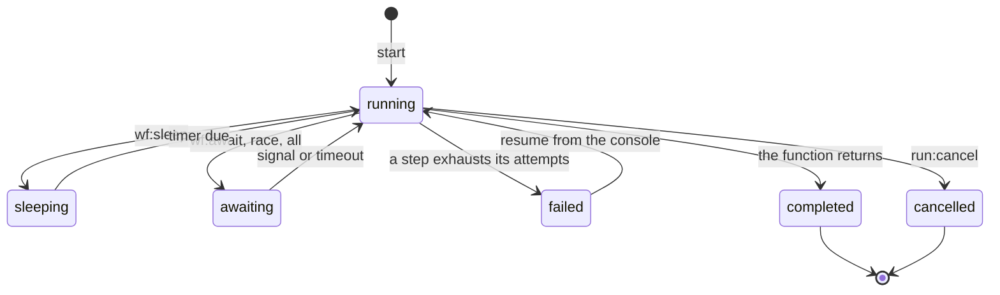
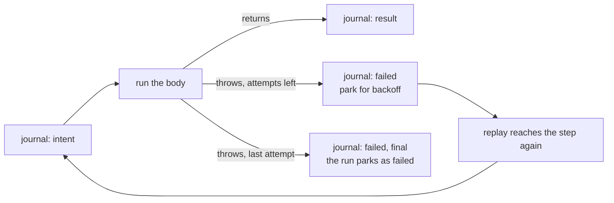

## What a workflow is

A workflow is a function that runs like ordinary code but can pause
for days and resume where it stopped, including across crashes and
deploys.

```lua
local sales = database "sales" { migrations = "migrations/sales" }
local Account = objects "Account"

local settle = workflow "settle-sale" (function(wf, sale)
    wf:step("notify", { retries = 3 }, function()
        Account(sale.winner):notify("pay-up", { price = sale.price })
    end)

    local paid, which = wf:race({ "paid", "cancelled" }, { timeout = "72h" })

    if which ~= "paid" then
        wf:step("void", { retries = 3 }, function()
            sales:exec("UPDATE sales SET state = 'void' WHERE id = ?", { sale.id })
        end)
        return { outcome = "void" }
    end

    wf:step("settle", { retries = 3 }, function()
        sales:exec("UPDATE sales SET state = 'settled' WHERE id = ?", { sale.id })
    end)

    return { outcome = "settled" }
end)
```

Start a run with an id you choose. The id is the run's identity, so a
retried start joins the run instead of making a second one:

```lua
settle:start({ id = "lot-42", winner = "ada", price = 25 },
    { id = "sale-lot-42" })
```

## Replay



Each step, signal and timer is journaled before it takes effect. A
resuming run replays the function from the top, and steps that already
ran return their recorded results instead of running again.

Run code must take the same path given the same journal. The platform
makes the usual sources of drift deterministic and refuses the rest:

<table>
  <thead>
    <tr><th>In run code</th><th>Behaviour</th></tr>
  </thead>
  <tbody>
    <tr><td><code>os.time()</code>, <code>os.clock()</code>, <code>math.random()</code>, <code>uuid.v4()</code></td><td>journaled on first run, replayed identically</td></tr>
    <tr><td><code>secret "name"</code></td><td>pinned to the version the run first resolved</td></tr>
    <tr><td><code>os.date</code>, <code>math.randomseed</code></td><td>refused</td></tr>
    <tr><td>kv, database and object calls outside a step</td><td>refused: effects belong inside <code>wf:step</code></td></tr>
    <tr><td><code>http</code>, <code>crypto</code>, <code>Jwt</code></td><td>absent, inside step bodies too</td></tr>
  </tbody>
</table>

Reach the network by calling an [object](/docs/runtime/objects) from a
step. The step records what the object returned, so replay does not
call again:

```lua
local receipt = wf:step("sign", function()
    return Registrar("desk"):sign(payload)
end)
```

## Steps

```lua
wf:step("name", function() ... end)
wf:step("name", { retries = 3, backoff = "5s", timeout = "30s" }, function() ... end)
```

<table>
  <thead>
    <tr><th>Option</th><th>Default</th><th>Means</th></tr>
  </thead>
  <tbody>
    <tr><td><code>retries</code></td><td>1</td><td>total attempts, not attempts after the first; 0 is read as 1</td></tr>
    <tr><td><code>backoff</code></td><td>2s</td><td>wait before attempt 2, doubling after that, with no cap</td></tr>
    <tr><td><code>timeout</code></td><td>none</td><td>how long one attempt may run; past it the attempt fails with <code>step 'name' timed out after Nms</code></td></tr>
  </tbody>
</table>



Step names must be stable across revisions, because replay matches
recorded results to them by name. When a step exhausts its attempts
the run parks as failed with `step 'name' failed after N attempts`,
keeps its journal, and the console can resume it.

### Making an effect safe to repeat

A step records its result after the body returns, so a crash in
between leaves the platform unable to know whether the effect
happened. `wf.step_id` names the effect the body is performing, so the
outside world can recognise a repeat:

```lua
wf:step("charge", { retries = 3 }, function()
    return Payments("desk"):charge(sale.price, wf.step_id)
end)
```

<table>
  <thead>
    <tr><th>Across</th><th><code>wf.step_id</code></th></tr>
  </thead>
  <tbody>
    <tr><td>a crash between the effect and its recorded result</td><td>stays the same, so the repeat is recognised</td></tr>
    <tr><td>a retry after a recorded failure</td><td>changes, because that attempt is a new effect</td></tr>
    <tr><td>the same step name reached again, in a loop</td><td>changes, because each pass is its own effect</td></tr>
    <tr><td>outside a step body</td><td>an error; there is no effect to name</td></tr>
  </tbody>
</table>

The same string works anywhere a repeat needs recognising: a row id,
an object key, a filename. The [reference](/docs/reference/workflow)
has its shape.

## Waiting

```lua
wf:sleep("24h")
wf:await("approved", { timeout = "48h" })
wf:race({ "paid", "cancelled" }, { timeout = "72h" })
wf:all({ "shipped", "received" }, { timeout = "7d" })
```

<table>
  <thead>
    <tr><th>Verb</th><th>Returns</th></tr>
  </thead>
  <tbody>
    <tr><td><code>sleep</code></td><td>nothing; resumes after the duration</td></tr>
    <tr><td><code>await</code></td><td>the signal payload, or nil on timeout</td></tr>
    <tr><td><code>race</code></td><td>the payload and the name that arrived first; the others keep their signals consumable</td></tr>
    <tr><td><code>all</code></td><td>payloads in argument order; a timed-out entry is nil. The timeout is per entry, waited in order</td></tr>
  </tbody>
</table>

A parked run holds no resources. It is journal rows and a timer.

## Signals

Signals come from outside the run, addressed by the run id:

```lua
local settle = workflows "settle-sale"

on "fetch" (function(request)
    if request.method == "POST" and request.path == "/api/sale/pay" then
        local body = json.parse(request.body)
        settle:get("sale-" .. body.id):signal("paid", { by = body.user })
        return { status_code = 200, body = "" }
    end
    return { status_code = 404, body = "" }
end)
```

A run id is a non-empty string without `/`. Choose it so a route can
address the run without a lookup table.

Duplicate signals are safe. An unconsumed extra is set aside rather
than breaking replay, which matters because buttons get clicked twice.

## Inspecting

The console lists runs with status and current step, shows the journal
as a timeline, and offers resume for failed runs and cancel for the
rest. Cancelling a run cancels the runs it spawned.

## Workflow or queue

If anyone will ask how one specific job is doing, use a workflow: runs
are named, inspectable and signalable, and each carries a journal.

Otherwise use a [queue](/docs/runtime/queues): anonymous, cheap,
retried in bulk. A queue handler can start a workflow when a message
turns out to need one.

### Gotchas

- `retries = 3` is three attempts in total, not one plus three.
- Steps do not nest. One effect per step; a `wf:step` inside a step
  body is an error.
- Renaming a step breaks runs already in flight. Replay compares the
  journal against the code it re-executes, and a mismatch fails the
  run with `journal divergence: expected step, code reached step
  'other'` rather than guessing.
- One script per project declares a given workflow. A second script
  publishing the same name is refused; reach it with `workflows`.

## Related

- [Queues](/docs/runtime/queues): the anonymous alternative.
- [workflow reference](/docs/reference/workflow): every method.
